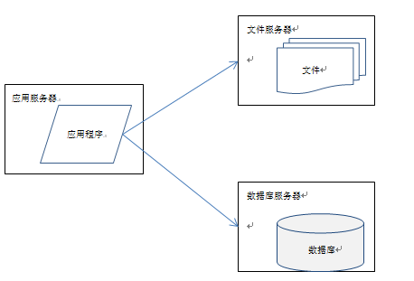
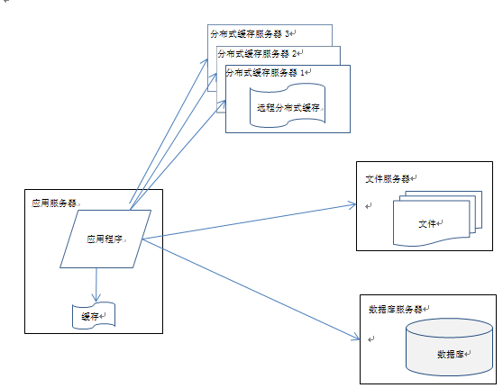

## 大型网站技术架构读书笔记

最近一直在读<大型网站技术架构>这本书, 对里面的观点非常赞同: 任何大型的技术架构都是"长出来的", 而不是设计出来的.

### 1. 网站架构的基本演变方式

网站最初的形态可能在一台服务器上, 后来由于数据量和业务的需要, 逐渐发展成如下架构:

应用服务器需要处理大量的业务逻辑，因此需要更快更强大的CPU；
数据库服务器需要快速磁盘检索和数据缓存，因此需要更快的硬盘和更大的内存
文件服务器需要存储大量用户上传的文件，因此需要更大的硬盘。
这个架构的问题是：数据库压力太大导致访问延迟，进而影响整个网站的性能

当业务量和数量量级再大一些的时候, 就需要加缓存, 架构演变如下:

网站使用的缓存可以分为两种：缓存在应用服务器上的本地缓存和缓存在专门的分布式缓存服务器上的远程缓存。
本地缓存的访问速度更快一些，但是受应用服务器缓存限制，其缓存数据量有限，而且会出现和应用程序争内存的情况。
远程分布式缓存可以使用集群的方式，部署大内存的服务器作为专门的缓存服务器，可以在理论上做到不受内存容量验证的缓存服务。

通过负载均衡调度服务器，可将来自用户浏览器的访问请求分发到应用服务器集群中的任何一台服务器上，如果有更多的用户，就在集群中加入更多的应用服务器，使应用服务器的负载压力不再成为整个网站的瓶颈。

目前大部分的主流数据库都提供主从热备功能，通过配置两台数据库主从关系，可以将一台数据库服务器的数据更新同步到另一台服务器上。利用这一点实现数据读写分离，从而改善数据库负载压力。

使用反向代理和CDN加速网站响应

使用分布式文件系统和分布式数据库系统，分布式数据库是网站数据库拆分的最后手段，只有在单表数据规模非常庞大的时候才使用。不到不得已时，网站更常用的数据库拆分手段是业务分库，将不同业务
的数据库部署在不同的物理服务器上。

### 2. 网站架构所使用的一般技术

网站架构模式

分层

分割

分布式方式： 1.分布式应用和服务、2.分布式静态资源、3.分布式数据和存储、4.分布式计算、5.分布式配置、6.分布式锁、7.分布式文件

集群：对同一个应用，需要单独不是服务器的集群化

缓存方式：1.CDN、2.反向代理、3.本地缓存、4.分布式缓存。缓存是改善软件性能的第一手段。使用缓存有两个前提条件：1.数据访问热点不均衡 2.数据在某段时间内有效，缓存除了可以加快数据访问速度，还可以减轻后端应用和数据存储的负载压力，网站数据库几乎都是按照有缓存的前提进行负载能力设计的。

异步：1.在第一服务器内部可通过多线程共享内存队列的方式实现异步，处在业务操作前面的线程将输出写入队列，后面的线程从队列中读取数据进行处理；2.在分布式系统中，多个服务器集群通过分布式消息队列实现异步，分布式消息队列可以看作内存队列的分布式部署。使用异步方式处理业务可能会对用户体验、业务流程造成影响，需要网站产品设计方面的支持。

冗余：访问和负载很小的服务也必须部署至少两台服务器构成一个集群，其目的就是通过冗余实现服务高可用。数据库除了定期备份，存档保存，实现冷备份外，为了保证在线业务高可用，还需要对数据库进行主从分离，实时同步实现热备份。

自动化：1.自动化代码管理 2.自动化测试 3.自动化安全检测 4.自动化部署 5.自动化监控 6.自动化监控 7.自动化报警 8.自动化失效转移 9.自动化失效恢复 10.自动化降级 11.自动化分配资源

### 3. 网站架构的非业务要素

一般说来，除了当前的系统功能需求外，软件架构还需要关注性能、可用性、伸缩性、扩展性和安全性这5个架构要素，架构设计过程中需要平衡这5个要素之间的关系，以实现需求和架构目标，也可以通过考察这些架构要素来衡量一个软件架构设计的优劣。

性能：衡量网站性能有一系列指标，重要的有响应时间，TPS，系统性能计数器等

可用性：网站高可用性的主要手段是冗余，应用部署在多台服务器上同时提供访问，数据存储在多台服务器上互相备份，任何一台服务器宕机都不会影响应用的整体可用，也不会导致数据丢失。对于应用服务器而言，多台应用服务器通过负载均衡设备组成一个集群共同对外提供服务，任何一台服务器宕机，只需把请求切换到其他服务器就可实现应用的高可用，但是一个前提条件是应用服务器上不能保存请求的会话信息。否则服务器宕机，会话丢失，即使将用户请求转发到其他服务器上也无法完成业务处理。

伸缩性：衡量架构伸缩性的主要标准就是是否可以用多台服务器构建集群，是否容易向集群中添加新的服务器。加入新的服务器后是否可以提供和原来的服务器无差别的服务。集群中可容纳的总的服务器数量是否有限制。对于应用服务器集群，只要服务器上不保存数据，所有服务器都是对等的，通过使用合适的负载均衡设备就可以向集群中不断加入服务器。。

扩展性：不同于其他架构要素主要关注非功能性需求，网站的扩展性架构直接关注网站的功能性需求。网站快速发展，功能不断扩展，如何设计网站的架构使其能够快速响应需求变化，是网站可扩展架构主要的目的。