## 企业安全入门笔记

### 安全理论模型

PDR模型：Protection(保护)、Detection(检测)、Response(响应)三个部分。
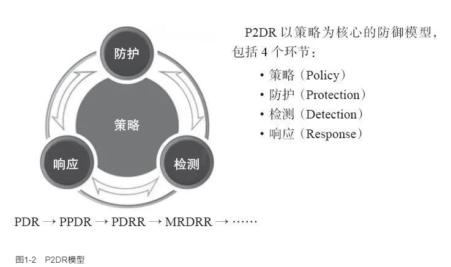

在这个模型下, 企业安全的各个产品分布
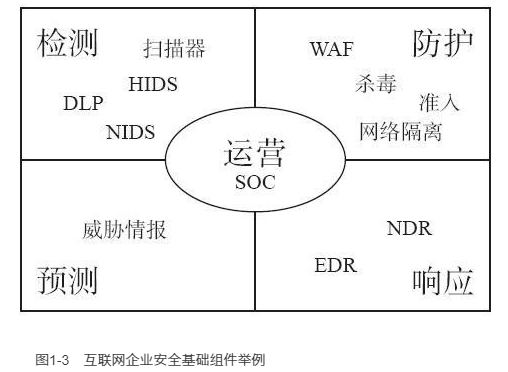

开源软件在该模型下的分布

### 防御体系
甲方安全的主要职责是保护公司互联网业务安全，比如：业务持续性、业务数据的私密性。
所以要优先解决以下问题：1）抗DDOS   2）防拖库   3）防后门

常见的防御体系：
1. 边界防御体系
2. 纵深防御体系。在Web领域至少会包含下面几层，数据库端、服务器端、网络层、网络边界。
3. 河防体系。河防体系特别适合数据中心用户
4.  塔防体系。云+端+边界+联动

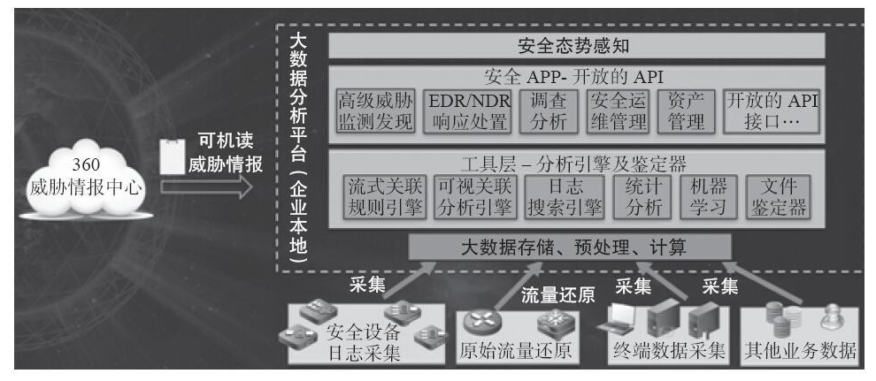

5. 下一代纵深防御体系。威胁情报好比是积累的知识，大数据和人工智能好比是聪明的大脑，WAF、SIEM、服务器安全等好比是有效的武器，大家互相配合，实现了下一代的纵深防御，在对已知威胁有较好的防御能力外，对于未知威胁也具有一定防御能力

### WAF产品
传统WAF在安全方面存在以下几个问题
1）防护能力不足以应对黑产
2） 缺乏有效的基础业务安全防护能力
3） 审计能力不足

理想中的WAF
1） 上下文理解能力
2） 语义分析能力
3）  机器学习能力
4）  审计取证能力
5）  威胁情报能力
6）  业务安全防护能力
7）  协同能力

分布式WAF集群架构
主要包括：四层负载均衡、WAF服务、WAF日志处理、WAF配置管理。每个部分均支持集群部署，快速横向扩展。
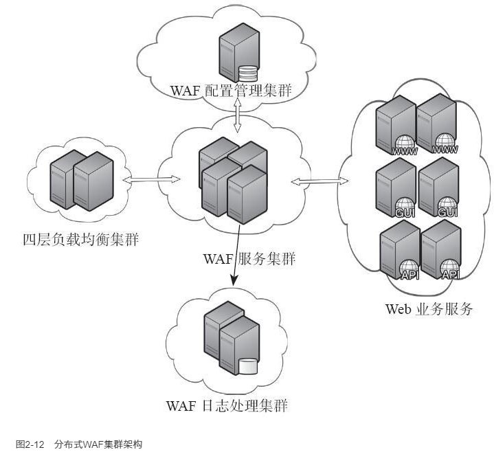

分布式WAF架构
1. 使用LVS做负载均衡
2. 使用zookeeper做配置管理
3. 使用storm做实时流式处理，使用Spark做离线分析，基于HDFS做离线存储，实时检索原始日志的需求使用ElasticSearch。日志分析：1）统计实时拦截报表 2）统计实时访问PV/UV 3）离线分析小时/天/周/月的PV/UV 4）离线保存原始日志 5）运行HMM分析漏报 6）运行语义分析漏报
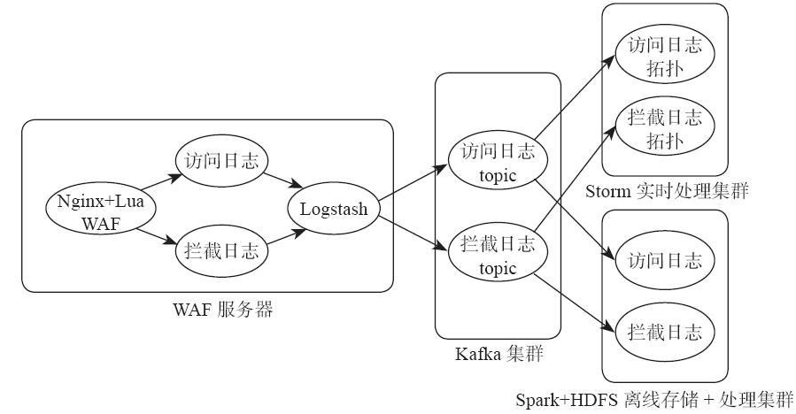

### 应用实时防护（RASP）
应用实时防护，又称RASP，以探针的形式，将保护引擎注入到应用服务中，可在文件、数据库、网络等多个层面，对应用进行全面的保护。当发生敏感的行为时，可以结合请求上下文进行判断，并阻断攻击，具有低误报率，低漏报率的优点。
WAVSEP（Web Application Vulnerability Scanner Evaluation Project）靶场，用于搭建测试环境。WAVSEP是一个包含漏洞的Web应用程序，目的是帮助测试Web应用漏洞扫描器的功能、质量和准确性。
baidu：[openrasp](https://rasp.baidu.com/)

### 业务网安全域
业务网安全域的划分：1.办公区 2.业务区 3.外网 4.办公服务区 5.开发测试服务区

### 主机安全资产管理信息收集和使用

业务服务器上需要部署osquery以及一个负责在ZooKeeper订阅命令的脚本，并将查询的结果发送给Kafka集群。管理服务器负责向ZooKeeper发送需要执行的SQL命令以及搜集Storm集群计算的结果，Storm处理服务器osquery查询的结果，根据规则将处理结果发送给管理服务器。

### 威胁情报
威胁情报：基于证据的知识，包括上下文、机制、指标、隐含和可操作的建议，针对一个先存的或新兴的威胁，可用于做出相应决定的知识。主要包括文件Hash值、IP地址、域名、网络或主机特征、攻击工具和TTPs（Tactics、Techniques & Procedures）
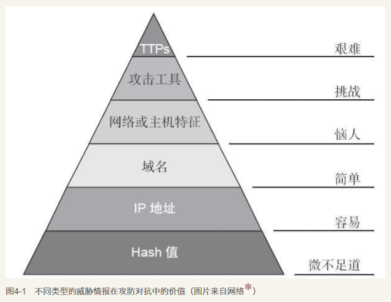

常见的开源威胁情报源包括以下几个：
| 名称              |      特点        |
| ---                 | ---                |
| ThreatMiner |    for IPv4, FQDN，MD5 and SHA2 lookups |
| Alienvault     |    OTX for IPv4, MD5 and SHA2 lookups |
| IBM X-Force |    Exchange for IPv4 lookups |
| VirusTotal  |   for MD5 and SHA2 lookups |
| Cymon.io    |   for IPv4 lookups |
| CIRCL          |   (Computer Incident Response Center Luxembourg) for CVE Lookups |
| PassiveTotal |   for FQDN Whois Lookups |
常见的威胁情报指标器包括以下几种形式：
IPv4，MD5，SHA2，CVE，FQDN

威胁情报和SOC系统联动
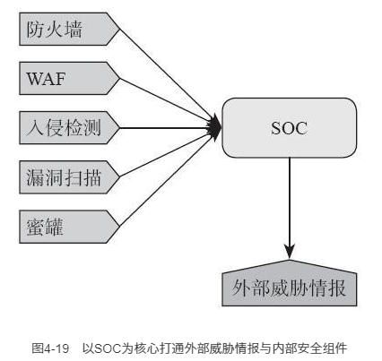

### 网关
Kong: API  网关
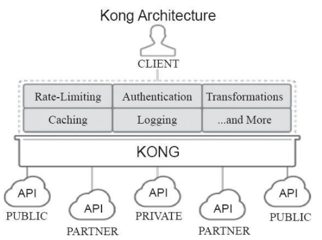

Nebula：业务风控系统
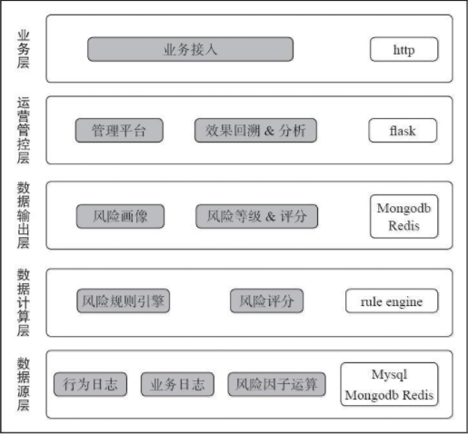

### 开源代码审计
RIPS：使用PHP语言编写的，用于静态审计PHP代码的安全性
VCG（Visual Code Grepper）：支持C/C++，C#，VB，PHP，Java和PL/SQL的免费代码安全审计工具。一款基于字典的检测工具，功能简洁，易于使用。

### 蜜罐
蜜罐突出的特点就是误报率低，准确度高。
开源蜜罐
+ Glastopf，一款Web服务蜜罐，项目地址为：https://github.com/glastopf/
+ Kippo，是一款优秀的SSH服务蜜罐，它提供了非常逼真的shell交互环境，项目地址为：https://github.com/desaster/kippo
+ Elasticpot，ElasticSearch服务蜜罐，项目地址为：https://github.com/jordan-wright/elastichoney
+ rdpy-rdphoneypot，RDP服务蜜罐，项目地址为：https://github.com/citronneur/rdpy
+ Conpot是一个开源的ICS/SCADA蜜罐，可以实现ModBus SNMP等PLC的外部子站服务的模拟仿真，项目地址为：http://conpot.org/
+ Dionaea是低交互式蜜罐，是Nepenthes（猪笼草）项目的后继，项目地址为：http://edgis-security.org/honeypot/dionaea/
+ amun与Dionaea类似，也是一款低交互式蜜罐，主要用于搜集恶意程序，项目地址为：https://sourceforge.net/projects/amunhoney/
+ wordpot是一款模拟wordpress服务的蜜罐，项目地址为：https://github.com/gbrindisi/wordpot
+ shockpot与Glastopf类似，是一款Web服务蜜罐，项目地址为：https://www.anomali.com/blog/shockpot

主动欺骗型蜜罐：[Beeswarm](https://github.com/honeynet/beeswarm)
Beeswarm由Beeswarm Server、Beewarm Drone Client 和 Beewarm Drone Honeypot组成。Beeswarm Drone Client伪装成真实用户或管理员，向Beeswarm Drone Honeypot发起访问，访问流量中会故意携带明文的用户信息或者登录口令，诱骗攻击者。Beeswarm Server收集Beeswarm Drone Client 和 Beeswarm Drone Honeypot 上报的攻击信息，然后进行综合判断。

蜜罐与SOC集成，蜜罐通常可以作为一类数据搜集器扩展SOC的数据源，蜜罐本身既可以产生相对高质量的报警，同时也可以作为原始数据源提供给SOC，SOC通过关联分析多数据源后，会做出更全面精准的判断。
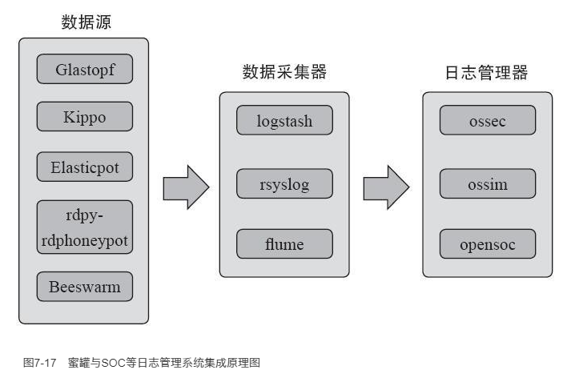

蜜罐联动WAF、SOC
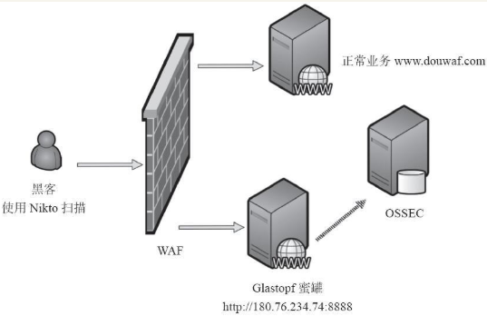

MHN（[Modern Honey Network](https://github.com/threatstream/mhn)）：蜜罐管理和数据收集服务，集成了多种蜜罐统一管理，并且集成了Snort，可以针对攻击行为进行攻击类型标记。MHN使用开源蜜罐来收集数据，整理后保存在mongodb中，收集到的信息也可以通过Web接口来展示或者通过开发的API访问，这里统称为WebApp。MHN能够提供多种开源的蜜罐，可以通过Web接口来添加他们。
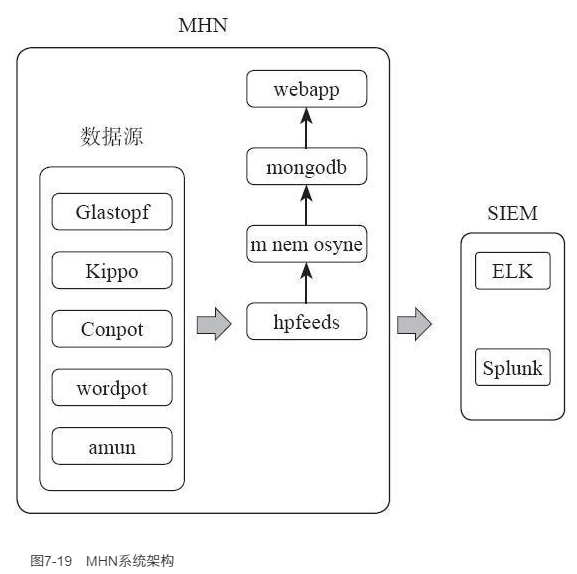

### 态势感知
态势感知由以下几个重要组成部分：漏洞扫描、入侵感知以及安全可视化、敏感信息泄露健康等内容。
常见的Web扫描器：Nikto、Paros proxy、WebInspect、OWASP ZAP、Burpsuite、IBM Security AppScan、Acunetix Web Vulnerability Scanner、SQLmap
基于Celery的Web扫描器系统架构
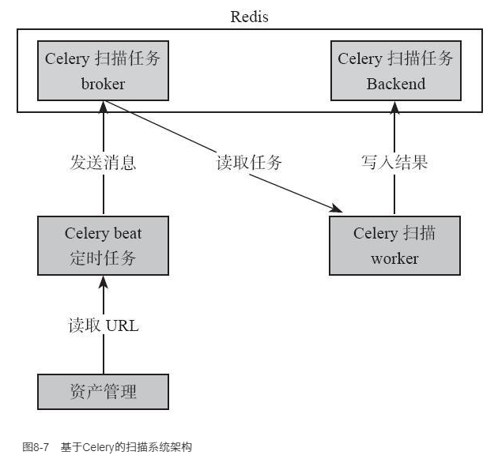

基于Celery的扫描系统工作流程
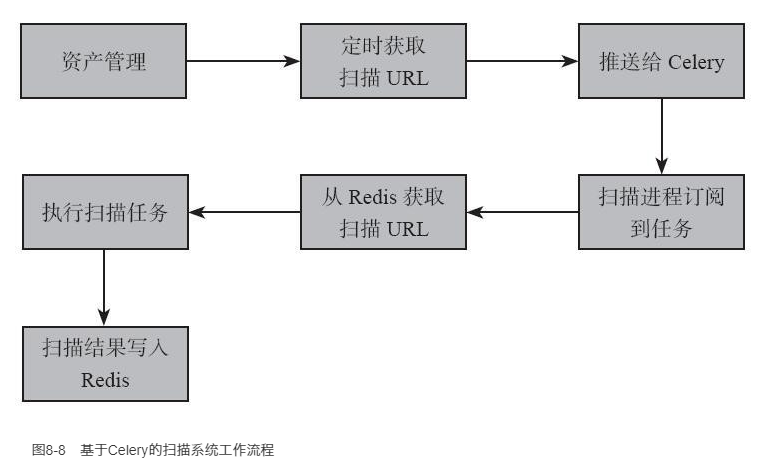

Celery 和 Docker技术结合起来完成分布式部署，同时为了提高Redis的性能和容量，会使用集群模式，整个系统通过Docker集群可以非常方便地根据性能情况动态调整Celery中扫描Worker的数量，通常一个worker对应一个Docker实例。
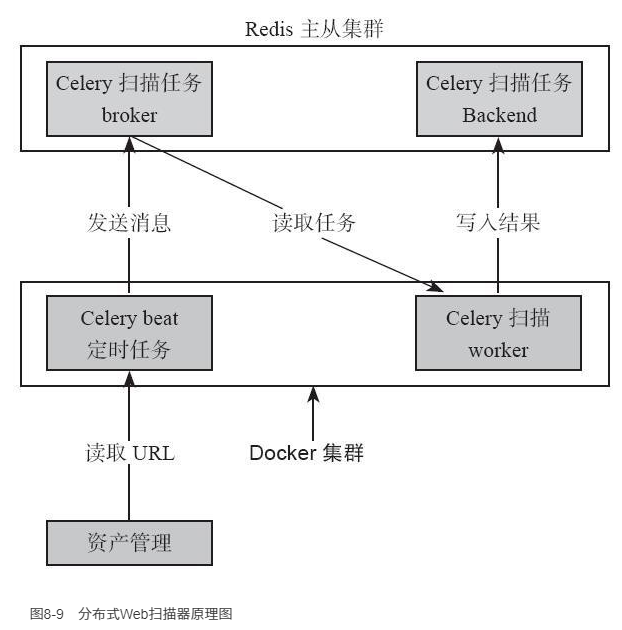

端口扫描的主要目标是：1.发现对外违规开放哦端口  2.发现在合法端口开放的违规服务 3.端口扫描还可以作为资产搜集的一个渠道。
nmap基本功能有三个：1.探测一组主机是否在线 2.扫描主机端口，嗅探所提供的网络服务 3. 推断主机所用的操作系统。
zmap比nmap快 1300倍， zmap采用了无状态的扫描技术，没有进行完整的TCP三次握手，因此极大地提升了扫描速度。
masscan也是无状态扫描，所以性能相对nmap，得到了大幅提升

### 入侵感知又称为入侵检测系统
攻击链模型

Web系统的入侵检测系统：
1. 从协议栈的角度分析，需要覆盖至少HTTP协议、数据库协议、DNS协议
2. 从数据搜集的角度分析，需要覆盖至少网络流量，数据库日志，Web服务器文件，服务器操作日志，DNS服务器查询日志，最好再包括服务器进程信息，PHP/JAVA组件内部调用数据，甚至业务层应用日志。
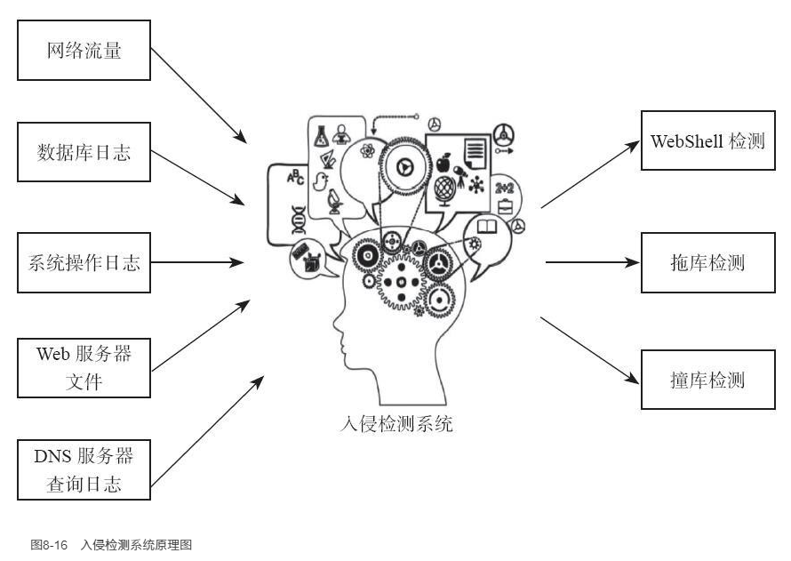

网络入侵检测系统
常见的网络全流量获取方式为交换机镜像、分光镜和网络分流器三种。
协议分析主要包括：1.包重组  2.TCP/UDP会话还原  3.应用层协议解析
libpcap主要有以下作用：
+ 捕获各种数据包，例如：网络流量统计。
+ 过滤网络数据包，例如：过滤掉本地上的一些数据，功能类似防火墙。
+ 分析网络数据包，例如：分析网络协议，数据的采集。
+ 存储网络数据包，例如：保存捕获的数据以备将来分析使用。

libpcap通常出来10M左右的流量时表现良好，超过10M以上流量时性能明显下降。
PF_RING处理1个G的流量是没问题的
大流量下可以使用DPDK，使用双网卡结合DPDK单机处理20G的案例
bro 是一款被动的开源流量分析器，它主要用于对链路上所有深层次的可疑行为流量进行安全监控。bro通常作为全流量的协议解析。bro支持分布式架构，用于处理大流量，其中主要组成部分为Frontend、Manager、Proxy 和 Worker
+ Frontend直接对接网路流量，并且把流量按照五元组或者直接按照IP将流量负责均衡到Worker上进行分析。事实上Bro并没有实现Frontend，通常Frontend可以使用专业的TAP设备或者使用交换机完成。
+ Manager统一接受来自Worker分析处理后的数据，统一记录日志或者按照要求发送给Kafka。Manager属于硬盘消耗型，对IO和存储都有消耗。
+ Proxy用于帮助Worker之间同步状态信息，便于Worker跨进程甚至跨主机同步状态数据。Proxy性能消耗不大，通常可以和Manager混布。
+ Worker是实际负责流量处理协议分析的工作单元，为了尽可能提高效率，Worker的处理都在内存中进行，几乎不需要使用硬盘资源，属于计算和内存使用型。根据Bro的官网说明，Worker的一个核可以承载最多250Mbps的流量的分析，也就是说如果要处理2个G的流量，至少需要8个核。
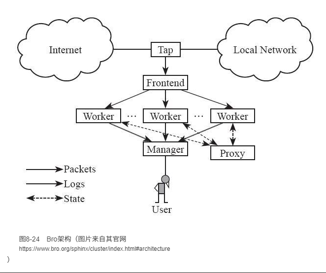

suricata 是一款网络入侵检测和阻止引擎软件，该引擎是多线程的，内置对IPV6的支持，可加载预设规则，支持Barnyard和Barnyard2工具，Suricata的架构图如下：

### 全流量的安全分析
1. 基于规则的分析：单向报文分析，双向报文分析（简单地讲就是关联分析请求和应答内容，如果请求中存在攻击特征，并且应答内容中出现对应的漏洞利用成功的内容，就可以判断攻击成功了），威胁情报
2. 基于时序的分析，心跳特征
3. 基于语义的分析，webshell注入，XSS、SQL注入
4. 基于沙箱的分析，或联动沙箱，文件检测
5. 基于机器学习的分析
6. _基于行为的分析*_

### 主机入侵检测
常见的开源主机入侵检测软件当属OSSEC。OSSEC是一款开源的、多平台的入侵检测系统，可以运行于Windows、Linux、OpenBSD/FreeBSD以及MacOS等操作系统中，包括了日志分析和Rootkit检测等。OSSEC支持C/S架构，同时也支持不安装客户端的情况，通过syslog协议接受日志分析。
OSSEC支持单机版和分布式版本，其中分布式版本为典型的C/S架构，分为server和agent。分布式OSSEC不仅可以支持agent直接搜集数据分析，还可以直接在不安装客户端的情况下，通过syslog等协议远程接受数据并分析，比如防火墙、路由器以及可以发送syslog的操作系统和安全设备都属于OSSEC架构，所以从某种角度来说，OSSEC也是一种SIEM/SOC软件。
OSSEC的核心功能可以概括为以下几个方面：
1. 日志分析。通过分析日志，发现异常行为
2. 文件完整性检查。监控操作系统中关键文件的修改情况，及时发现篡改行为
3. RootKit检测。检测Linux系统常见的RootKit行为。
4. 动态响应。根据日志分析、文件完整性检测或者RootKit检测的结果，进行动态响应，包括但不限于防火墙封禁、账户禁用等。
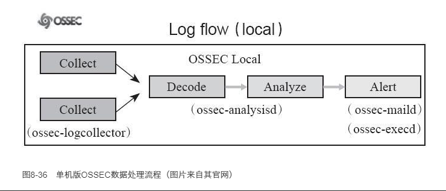
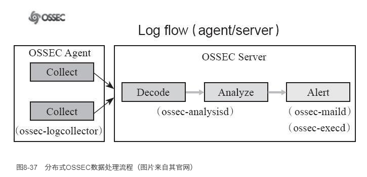
OSSEC内部数据处理过程：先经过预解码、解码完成后、再匹配规则

### 物联网IOT以及工控设备ICS入侵检测
Sweet Security是基于Bro和ELK的针对IOT和ICS的安全监控软件。它通过Bro支持常见的DNS、HTTP等协议，同时支持了Modbus和DNP3协议。Sweet Security通过监控IOT和ICS的通信流量，识别攻击行为，甚至是基于Modbus和DNP3协议的攻击，攻击的结果会保存在本地，并且支持进一步发送给ELK或者常见的日志搜集系统，比如SOC。
支持以下操作系统：
+ Raspbian Jessie
+ Debian Jessie
+ Ubuntu 16.04
目前支持的硬件平台：
+ RaspberryPi 3
+ x86
+ x86_64
推荐的硬件配置为：
+ ARM，x86，or x86_64 CPU
+ 2GB RAM
+ 8GB Disk Storage
+ 100 MB NIC
Sweet Security也支持分布式部署，一个推荐的分布式架构如图所示，该架构包括分别执行ARP Spooling、Network Scans 和 Bro IDS Inspection 的三个客户端和一个基于Web的服务器。

### SOC
常见的开源SOC软件主要有：OSSIM 和 OpenSOC。
OSSIM即开源安全信息管理系统，是一个非常流行和完整的开源安全架构体系。OSSIM由数据收集、监视、检测、审计以及控制台这五个模块构成。这五个模块包含了目前安全领域内从事件预防到事件处理的一个完整过程，在目前的安全架构中，OSSIM是最为完备的。这五个功能模块又被划分为三个层次，分别是高层的安全信息显示控制面板、中层的风险和活动监控以及底层的证据控制台和网络监控，各个层次提供不同功能，共同保证系统的安全运转。
在OSSIM中，整个过程处理被划分为两个阶段，这两个阶段反映的是一个事件从发生到处理不同的时期。这两个阶段分别为预处理阶段，这一阶段的处理主要由监视器和探测器来共同完成，主要是为系统提供初步的安全控制；以及事后处理阶段，这一阶段的处理更加集中，更多的是反映在事件发生之后系统安全策略的调整和整个系统的安全配置的改进。
在OSSIM的架构体系中，有三个部件比较引人注意，即OSSIM中的三个策略数据库，是OSSIM事件分析和策略调整的信息来源，分别为以下三种数据库：
+ EDB（事件数据库）：在三个数据库中，EDB无疑是最大的，它存储了所有底层的探测器和监视器所捕捉到的所有的事件。
+ KDB（知识数据库）：在知识数据库中，将系统的状态进行了参数化的定义，这些参数将为系统的安全管理提供详细的数据说明和定义。
+ UDB（用户数据库）：在用户数据库中，存储了用户的行为和其他与用户相关的事件。

OpenSOC是各种开源大数据架构和安全分析工具的有机结合。OpenSOC主要由数据源系统、数据收集层、消息系统层、实时处理层、存储层和分析处理层组成。目前OpenSOC已经加入Apcache并改名为Apache Metron
OpenSOC主要功能包括：
+ 可扩展的接收器和分析器能够监视任何数据源。
+ 支持对数据流的异常检测和基于规则的实时告警。
+ 支持使用Elasticsearch实现自动化实时索引数据流。
+ 支持使用Hive利用SQL查询存储在Hadoop中的数据。
+ 能够兼容ODBC/JDBC和继承已有的分析工具。
+ 具有丰富的分析应用功能且能够集成已有的分析工具。
+ 支持自动生成报告和异常报警。
+ 支持原始网络数据包的抓取、存储和重组。

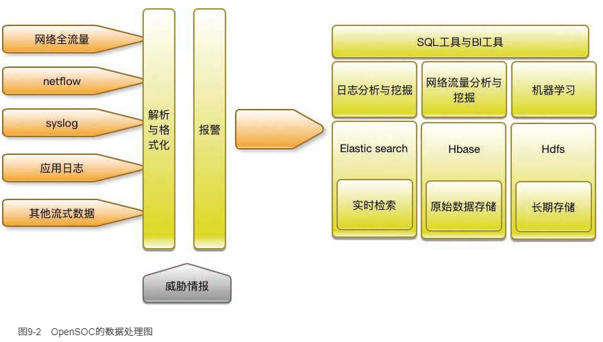

SOC的数据源常见的包含以下六种：1. 网络流量   2. 文件  3. Syslog   4. SNMP  5. 数据库  6. 爬虫

网络全流量包含完整的网络数据，即TCP/IP协议栈的数据，比如：MAC头、IP头、TCP头、HTTP头以及HTTP载荷数据，对于分析网络中的攻击行为帮助非常大。

Netflow提供网络流量的会话级视图

数据收集层
数据收集层常用软件包括Logstash和Flume，针对网络全流量收集还有Bro软件。
消息系统层
消息系统是整个机器学习框架的信息高速公路，数据的进出都依赖于它。最常使用的消息系统是KafKa。KafKa系统由以下几个部分组成：Broker，Topic，Parition，Consumer Group. KafKa通过ZooKeeper管理集群，选举leader。
实时处理层
实时处理层主要使用Storm，Storm是一个免费开源、分布式、高容错的实时计算系统。
Storm主要分为Nimbus和Supervisor两种组件，这两种组件本地都不保存状态，任务状态和心跳信息等都保存在Zookeeper上，提交的代码资源都在保存本地机器的硬盘上。
Storm提交运行的程序称为Topology，Topology处理的最小消息单位是一个Tuple，也就是一个任意对象的数组。Topology由Spout和Bolt构成。Spout是发出Tuple的结点。Bolt可以随意订阅某个Spout或者Bolt发出的Tuple。Spout和Bolt都统称为component。

存储层

1. HDFS，Hadoop分布式文件系统(HDFS)，HDFS是一个主从结构，一个HDFS集群具有一个名字节点(Namenode)，它是一个管理文件命名空间和协调客户端访问文件的主服务器；还有一些数据节点(Datanode)，通常是一个节点一个机器，它来管理对应节点的存储。HDFS对外开放文件命名空间并允许用户数据以文件形式存储和访问。其内部机制是将一个文件分割成一个或多个块，这些块被存储在一组数据节点中。名字节点用来操作文件命名空间的文件或目录，如打开，关闭，重命名等，同时确定块与数据节点的映射。数据节点负责来自文件系统客户的读写请求，同时还要执行块的创建，删除和来自名字节点的块复制指令。名字节点是仲裁者和所有HDFS元数据的仓库，用户实际数据的读写不经过名字节点。
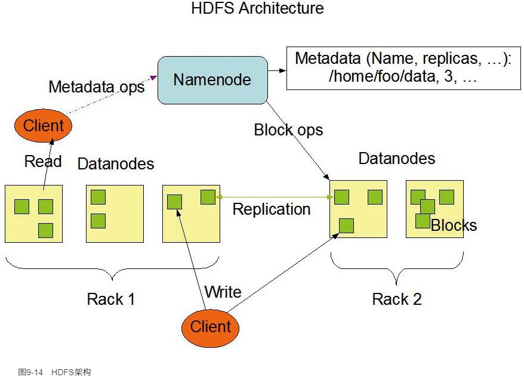

2.  HBase，HBase是一个高可靠、高性能、面向列、可伸缩的分布式存储系统。HBase利用Hadoop HDFS作为其文件存储系统。HBase利用Hadoop MapReduce来处理HBase中的海量数据，利用ZooKeeper作为协同服务。
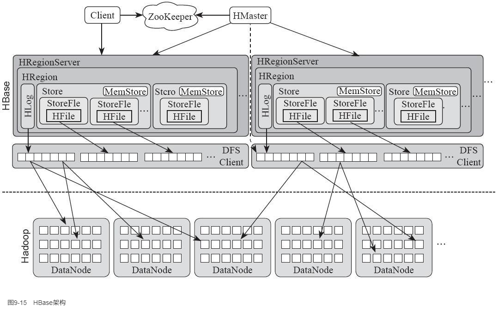
Pig和Hive还为HBase提供了高层语言支持，使得在HBase上进行数据统计处理变得非常简单，Sqoop则为HBase提供了方便的RDBMS数据导入功能。
HBase由以下几个组件构成：
+ HBase Client使用HBase的RPC机制与HMaster和HRegionServer进行通信，对于管理类操作，Client与HMaster进行RPC；对于数据读写类操作，Client与HRegionServer进行RPC。
+ Zookeeper中除了存储-ROOT-表的地址和HMaster的地址，HRegionServer也会把自己以Ephemeral方式注册到Zookeeper中，使得HMaster可以随时感知到各个HRegionServer的健康状态。
+ HMaster没有单点故障问题，HBase中可以启动多个HMaster，通过Zookeeper的Master Election机制保证总有一个Master运行，HMaster在功能上主要负责Table和Region的管理工作。
+ HRegionServer主要负责响应用户I/O请求，向HDFS文件系统中读写数据，是HBase中最核心的模块。

3. ElasticSearch
Marvel是Elasticsearch的管理和监控工具，在开发环境下免费使用。
./bin/plugin -i elasticsearch/marvel/latest
禁用监控，可以通过以下命令关闭Marvel
echo 'marvel.agent.enabled: false' >> ./config/elasticsearch.yml
离线分析处理层
1. Spark，Apache Spark是专为大规模数据处理而设计的快速通用的计算引擎。Spark拥有Hadoop MapReduce的所有优点，但不同于MapReduce的是，Job中间输出结果可以保存在内存中，从而不再需要读写HDFS，因此Spark能更好地适用于数据挖掘与机器学习等需要迭代的MapReduce算法
2. TensorFlow，TensorFlow是一个采用数据流图，可用于数值计算的开源软件库。节点在图中表示数学操作，线在图中表示节点间相互联系的多维数据数组，即张量。

SOC普遍的数据收集流程
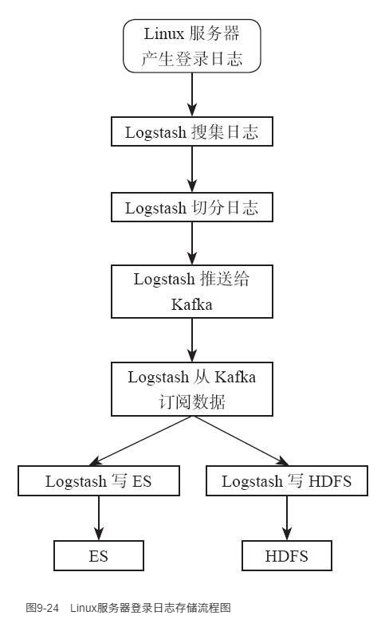

流式处理过程
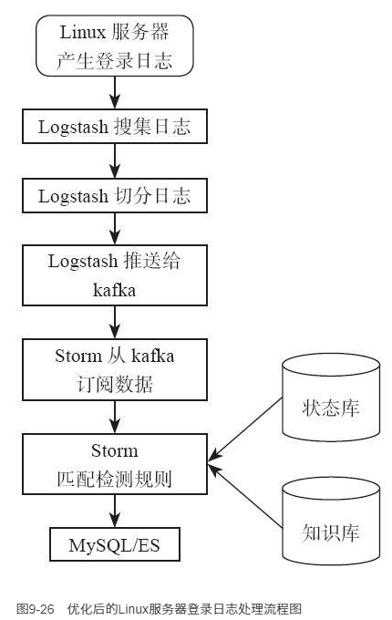

storm中Linux服务器账户被盗检测逻辑图

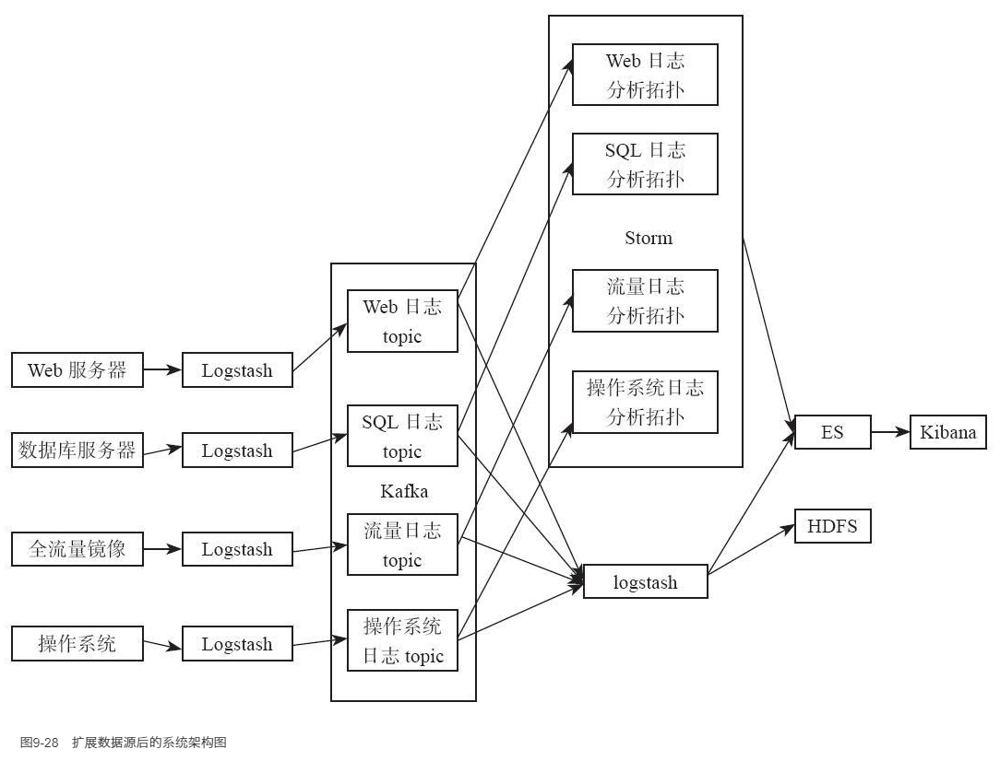

### 数据库安全
1. 开源数据库主机端审计mysql-audit
2. 开源数据库流量审计MySQL sniffer，全流量采集，协议分析
3. 开源数据库防火墙DBProxy

### 数据防泄漏
