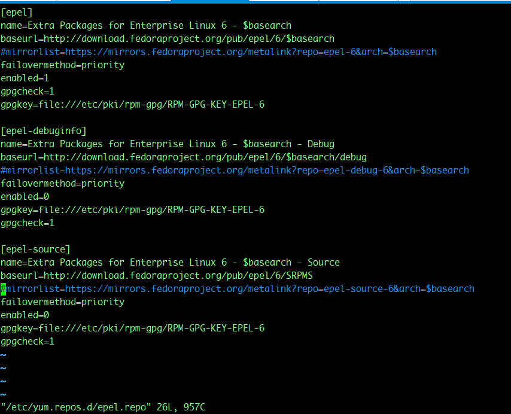

由于Centos6 系统有些年头了，所以安装epel库会出现各种问题

先 通过命令来安装 yum install -y epel-release, 安装好了后，执行命令yum makecache，会发现无法连接到epel的源

会显示如下错误：
```bash
http://download.fedoraproject.org/pub/epel/6/x86_64/repodata/f3a638252f36722fa11f813216013305a6e8a95516f8919dc34fb7c8d9f39958-other.sqlite.bz2: 
[Errno 14] problem making ssl connection
Trying other mirror.
Error: failure: repodata/f3a638252f36722fa11f813216013305a6e8a95516f8919dc34fb7c8d9f39958-other.sqlite.bz2 from epel: 
[Errno 256] No more mirrors to try.
```

这是因为官方的ssl证书已经更新了，需要进行ca证书认证更新。但是由于epel源连接不上，导致yum安装命令无法使用，需要先卸载
```bash
yum erase epel-release
```
再执行下面的命令，进行安装。所以正确的安装姿势如下：
```bash
#更新证书文件
yum -y update  ca-certificates
# 安装epel库
yum install -y epel-release
#清空缓存
yum clean all
#生成本地缓存
yum makecache
```

安装完成后，可能有些同学还是连接不上mirror站点，报其他问题，这个时候，可以修改epel源的配置文件：
把mirror注释掉，使用baseurl。这相当于不从镜像源去请求，直接使用fedora的官方源。还是推荐使用mirrorlist的，因为它可以给你调整最快的响应速度的源库
```bash
vim /etc/yum.repos.d/epel.repo
```



