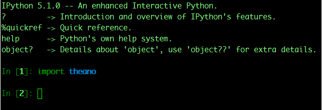

安装Theano不太难，但是在安装的时候确实遇到了一些坑，记录一下，免得以后忘记了。（实际上以前装过一次，但是没写下来，这几天又爬了一遍坑）

 ***在安装theano之前下列举下，theano的工具依赖：***
 必须：
 
1. Linux, Mac OS X 和Windows 操作系统。
   推荐操作系统使用64位的，theano官方开发的系统为64位Linux 系统，其他版本的系统未实际测试。所以安装theano最好使用Linux 64bit
2. Python 2 >=2.6 or Python 3 >= 3.3。
   系统中需要安装python的开发包（centos 安装 python-devel， ubuntu安装python-dev）。Python2.4仅支持到theano 0.6的版本；Python3 必须大于3.3，才能使用theano
3. g++编译器（Linux和Windows平台），clang(macOS平台)。
   编译器是必须的，除了g++外，还应该包含gcc编译器，在有些版本的Linux中gcc不是默认安装的（例如：Centos Mini版本）
4. NumPy>=1.7.1, 小于1.7.1版本的NumPy包可能能够使用，但是theano官方没有经过测试，所以不推荐使用1.7.1之前的版本，最好是使用NumPy最新的版本。
   推荐使用pip install numpy安装，也可以是yum安装python-numpy。但是pip安装numpy能保证最新版本的更新和获取。
5. SciPy>=0.11，SciPy包对稀疏矩阵和矩阵函数的支持是theano所必须的，推荐使用0.11版本以上的。
   通过pip install scipy 安装。不要使用scipy0.8版本以下的，因为在0.8版本以下的SciPy包对解析稀疏矩阵存在BUG。
6. BLAS（基础线性代数程序集）库的安装。
   系统中需要安装BLAS的库，Linux根据版本安装以-dev, -devel结尾的包（yum install blas-devel lapack-devel atlas-devel，centos安装命令），Mac OS X已经自带了，Windows 需要在网上下载二进制安装包。
 
可选：

1. nose>=1.3.0 和nose-parameterized>=0.5.0。
   运行theano测试用例必须的包，也能跑numpy和scipy的测试用例。推荐使用pip install nose nose-parameterized安装
2. Sphinx>=0.5.1和pygments，构建theano文档必须的库。pip install sphinx pygments
3. Git 。获取theano最新代码的工具。
4. graphiz 和 pydot-ng。graphiz使theano能够生成Theano计算图。pydot-ng是graphiz的接口包，是对老版本的pydot包的替代和兼容。
   安装系统库命令：yum install graphviz graphviz-devel graphviz-doc graphviz-graphs。安装Python 包命令： pip install pydot-ng
5. NVIDIA CUDA 驱动和SDK。这是必须的安装包，对于使用NVIDIA GPU来做theano计算。
6. libgpuarray，libgpuarray是使用CUDA和OpenCL必须要求使用的依赖包。

***Centos 7 安装 theano***
```bash
sudo yum install python-devel gcc gcc-gfortran gcc-c++ blas-devel lapack-devel atlas-devel
sudo yum install graphviz graphviz-devel graphviz-doc graphviz-graphs
sudo pip install pydot-ng
sudo pip install nose nose-parameterized
sudo pip install sphinx pygments
sudo pip install numpy scipy
sudo pip install Theano
```

测试Theano，NumPy和SciPy是否安装成功

1. NumPy测试，耗时30s：`python -c "import numpy; numpy.test()"`
2. SciPy测试，耗时1m：`python -c "import scipy; scipy.test()"`
3. Theano测试，耗时30m：`python -c "import theano; theano.test()"`

Theano的测试通常非常慢，推荐使用Theano/BLAS方法来测试Theano，BLAS是非常快的线性代数库，比NumPy和SciPy快了大概10倍。测试命令例如：
```bash
python /usr/lib/python2.*/site-packages/theano/misc/check_blas.py
```

***问题***
安装theano完成后，在python 代码中，敲入：import theano，包括上面测试的时候，报错如下：


网上查询+分析后，定位原因在于：
Python 在编译的时候，libpython2.7.a库中的abstract.o模块的编译过程中，没有加上-fPIC；如果是系统自带的Python，一般是缺失这个参数的。解决方法网上说，是重新编译一套带fPIC参数的Python。
但是我不想替换掉系统的Python，于是就想能不能，在一台虚拟机上编译带fPIC参数的Python，编译好了以后，将生成的libpython2.7.a去替换掉目的机器的libpython2.7.a。
编译Python的脚步命令：
```bash
cd /tmp
wget https://www.python.org/ftp/python/2.7.12/Python-2.7.12.tar.xz
tar xf Python-2.7.12.tar.xz
cd Python-2.7.12
./configure --prefix=/usr/local/ --enable-shared CFLAGS=-fPIC
make && make install
```
ps： 编译需要gcc和gcc-c++，必须保证编译的系统中安装了这两个编译器

安装后的Python库在/usr/local/lib下，如图：

libpython2.7.so.1.0就是我们要找的库

拷贝出 libpython2.7.so.1.0，放到目标机器中的相应目录，从报错中可以找到该目录，上面报错中说的目录是/opt/workplace/pyenv/versions/2.7.12/lib。
```bash
mv ./libpython2.7.a ./libpython2.7.a.bak
chmod 555 libpython2.7.so.1.0
ln -s libpython2.7.so.1.0 libpython2.7.a
```

再运行python， 执行import theano。

没有报错了，说明替换成功了，解决了该问题。
ps：自己编译出来的libpython2.7.a比系统提供的要小很多，不知道有没有什么影响，待观察。实际使用了一些Python库，都没有问题。