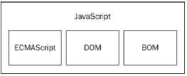
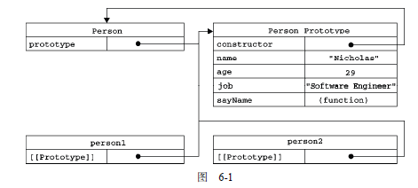
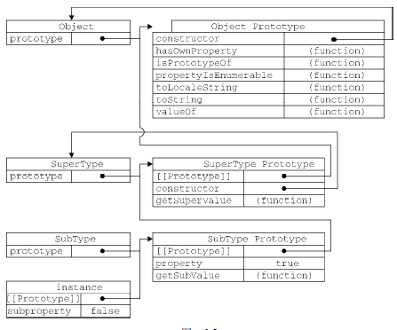

***javascript核心基础学习***

一个完整的JavaScript实现由下列三个不同的部分组成
1. 核心（ECMAScript）
2. 文档对象模型（DOM）
3. 浏览器对象模型（BOM）



ECMA-262定义的ECMAScript与Web浏览器没有依赖关系，ECMA-262定义的只是这门语言的基础，它规定了这门语言的下列组成部分：
1. 语法 2. 类型 3. 语句 4. 关键字 5. 保留字 6. 操作符 7. 对象
第3版标志着ECMAScript成为了一门真正的编程语言。
IE9中提供了对ECMA-262第5版的完整支持。

文档对象模型（DOM， Document Object Model）是针对XML但经过扩展用于HTML的应用程序编程接口（API）。DOM把整个页面映射为一个多层节点结构。
DOM并不只是针对JavaScript的，很多别的语言也都实现了DOM。

DOM1级由两个模块组成：DOM核心（DOM Core）和DOM HTML
DOM2级引入了下列新模块：
1. DOM视图（DOM Views）
2. DOM事件（DOM Events）
3. DOM样式（DOM Style）
4. DOM遍历和范围（DOM Traversal and Range）
DOM3级对DOM做了进一步扩展：
1.DOM加载和保存（DOM Load and Save）
2.DOM验证模块 （DOM Validation）

BOM 浏览器对象模型，开发人员使用BOM可以控制浏览器显示的页面以外的部分。

关键字和保留字
ECMA-262描述了一组具有特定用途的关键字，这些关键字可用于表示控制语句的开始或结束，或者用于执行特定操作等。按照规则，关键字也是语言保留的，不能用作标识符。
ECMA-262还描述了另外一组不能用于用作标识符的保留字。尽管保留字在这门语言中还没有任何特定的用途，但是它们有可能在将来被用作关键字。

ECMAScript中有5种简单数据类型（也称为基本数据类型）: Undefined、Null、Boolean、Number和String。还有1种复杂数据类型----Object，Object本周上是由一组无序的名值对组成的。ECMAScript不支持任何创建自定义类型的机制，而所有值最终都将是上述6种数据类型之一。
_永远不要测试某个特性的浮点数值。_
与其他语言不同，ECMAScript没有为整数和浮点数值分别定义不同的数据类型，Number类型可用于表示所有数值。

Object类型是所有它的实例的基础。Object类型所具有的任何属性和方法也同样存在于更具体的对象中。

语句
do-while是种后测试循环语句，最常用于循环体中的代码至少要被执行一次的情形。
while语句属于前测试循环语句，也就是说，在循环提内的代码被执行前，就会对出口条件求值。因此，循环体内的代码可能永远不会被执行。
for语句也是一种前测试循环语句，但它具有在执行之前初始化变量和定义循环后要执行的代码的能力。
如果表示要迭代的对象的变量值为null或undefined，for-in语句会抛出错误。ECMAScript5更正了这一行为：对这种情况不再抛出错误，而只是不执行循环体。为了保证最大限度的兼容性，建议在使用for-in循环之前，先检测确认该对象的值不是null或undefined。

函数
return语句可以不带有任何返回值。在这种情况下，函数在停止执行后将返回undefined值。这种用法一般用在需要提前停止函数执行而又不需要返回值的情况下。
实际上，在函数体内可以通过arguments对象来访问这个参数数组，从而获取传递给函数的每一个参数。

如果变量是给定引用类型（根据它的原型链来识别）的实例，那么instanceof操作符就会返回true
每个执行环境都有一个与之关联的变量对象（variable object），环境中定义的所有变量和函数都保存在这个对象中。

使用var声明的变量会自动被添加到最接近的环境中。在函数内部，最接近的环境就是函数的局部环境；在with语句中，最接近的环境是函数环境。如果初始化变量时没有使用var声明，该变量会自动被添加到全局环境。变量的执行环境有助于确定应该何时释放内存。
JavaScript具有自动垃圾收集机制，也就是说，执行环境会负责管理代码执行过程中使用的内存。这种垃圾收集机制的原理其实很简单：找出那些不再继续使用的变量，然后释放其占用的内存。为此，垃圾收集器会按照固定的时间间隔（或代码执行中预定的收集时间），周期性的执行这一操作。
内存限制问题不仅会影响给变量分配内存，同时还会影响调用栈以及在一个线程中能够通知执行的语句数量。

引用类型有时也被称为对象定义，因为它们描述的是一类对象所具有的属性和方法。
对象是某个特定引用类型的实例。新对象是使用new操作符后跟一个构造函数来创建的。构造函数本身就是一个函数，只不过该函数是出于创建新对象的目的而定义的。
ECMAScript提供了很多原生引用类型。创建Object实例的方式有两种。第一种是使用new操作符后跟Object构造函数。另一种方式是使用对象字面量表示发。对象字面量是对象定义的一种简写形式，目的在于简化创建包含大量属性的对象的过程。
最好的做法是对那些必需值使用命令参数，而是要对象字面量来封装多个可选参数。

引用类型与基本包装类型的主要区别就是对象的生存期。使用new操作符创建的引用类型的实例，在执行流离开当前作用域之前都一直保存在内存中。而自动创建的基本包装类型的对象，则只存在于一行代码的执行瞬间，然后立即被销毁。

ECMA-262把对象定义为：”无序属性的集合，其属性可以包含基本值，对象或者函数“，我们可以把ECMAScript的对象想象成散列表：无非就是一组名值对，其中值可以是数据或函数。每个对象都是基于一个引用类型创建的，也可以是开发人员定义的类型。

可以通过Object.defineProperty 和 Object.defineProperties来详细创建JavaScript中的对象属性。使用Object.getOwnPropertyDescriptor方法来读取一个对象的属性设置。在JavaScript中，可以针对任何对象--包括DOM和BOM对象，使用Object.getOwnPropertyDescriptor()方法。Object.getOwnPropertyDescriptor()方法只能用于实例属性，要取得原型属性的描述符，必须直接在原型对象上调用Object.getOwnPropertyDescriptor()方法。

任何函数，只要通过new操作符来调用，那它就可以作为构造函数；而任何函数，如果不通过new操作符来调用，那它跟普通函数也不会有什么两样。


无论什么时候，只要创建了一个新函数，就会根据一组特定的规则为该函数创建一个prototype 属性，这个属性指向函数的原型对象。在默认情况下，所有原型对象都会自动获得一个constructor （构造函数）属性，这个属性包含一个指向prototype 属性所在函数的指针。就拿前面的例子来说，Person.prototype.constructor 指向Person。而通过这个构造函数，我们还可继续为原型对象 添加其他属性和方法。 

创建了自定义的构造函数之后，其原型对象默认只会取得constructor 属性；至于其他方法，则 都是从Object 继承而来的。当调用构造函数创建一个新实例后，该实例的内部将包含一个指针（内部 属性），指向构造函数的原型对象。ECMA-262 第5 版中管这个指针叫[[Prototype]]。虽然在脚本中 没有标准的方式访问[[Prototype]]，但Firefox、Safari 和Chrome 在每个对象上都支持一个属性 __proto__；而在其他实现中，这个属性对脚本则是完全不可见的。不过，要明确的真正重要的一点就 是，这个连接存在于实例与构造函数的原型对象之间，而不是存在于实例与构造函数之间。
ECMAScript 5 增加了一个新方法，叫Object.getPrototypeOf(),在所有支持的实现中，这个方法返回[[Prototype]]的值。

每当代码读取某个对象的某个属性时，都会执行一次搜索，目标是具有给定名字的属性。搜索首先从对象实例本身开始。如果在实例中找到了具有给的名字的属性，则返回该属性的值；如果没有找到，则继续搜索指针指向的原型对象，在原型对象中查找具有给定名字的属性。如果在原型对象中找到了这个属性，则返回该属性的值。这正是多个对象实例共享原型所保存的属性和方法的基本原理。

虽然可以通过对象实例访问保存在原型中的值，但却不能通过对象实例重写原型中的值。如果我们在实例中添加了一个属性，而该属性与实例原型中的一个属性同名，那我们就在实例中创建该属性，改属性将会屏蔽原型中的那个属性。

要取得对象上所有可枚举的实例属性，可以使用ECMAScript5的object.keys()方法。这个方法接收一个对象作为参数，返回一个包含所有可枚举属性的字符串数组。如果要得到所有实例属性，无论它是否可枚举。都可以使用Object.getOwnPropertyNames()方法。

创建自定义类型的最常见方式，就是组合使用构造函数模式与原型模式。构造函数模式用于定义实例属性，而原型模式用于定义方法和共享的属性。结果，每个实例都会有自己的一份实例属性的副本，但同时又共享着对方法的引用，最大限度地节省了内存。另外，这种混成模式还支持向构造函数传递参数；可谓是集两种模式之长。

构造函数在不返回值的情况下，默认会返回新对象实例。而通过在构造函数的末尾添加一个return语句，可以重写调用构造函数时返回的值。

许多OO语言都支持两种继承方式：接口继承和实现继承。
在ECMAScript中无法实现接口继承。ECMAScript只支持实现继承，而且其实现继承主要是依靠原型链来实现的。

实现原型链有一种基本模式, 其代码大致如下:
```javascript
function SuperType() {
    this.property = true
}

SuperType.prototype.getSuperValue = function() {
    return this.property;
};

function SubType() {
    this.subproperty = false
}

//继承了 SuperType
SubType.prototype = new SuperType();

SubType.prototype.getSubValue = function() {
    return this.subproperty;
};

var instance = new SubType()
alert(instance.getSuperValue()); //ture
```



一句话，SubType继承了SuperType，而SuperType继承了Object。当调用instance.toString()时，实际上调用的是保存在Object.prototype中的那个方法。