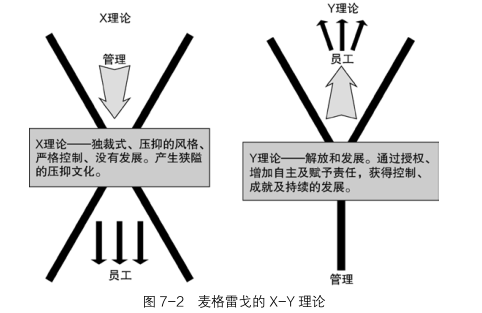
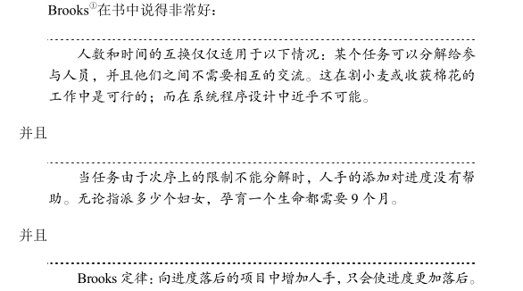

**告别失控学习笔记**

人月神话里很好总结了程序设计充满乐趣的原因
第一，是纯粹的创造的愉悦
第二，是做出对其他人有用的东西而带来快乐
第三，是设计组装谜题一样环环相扣的复杂部件，并观看它巧妙地运转而产生的吸引力
第四，是持续学习的乐趣，这来源于任务的无重复特性
第五，工作的对象是可以自由驾驭的代码，令人开心。程序员像诗人一样，操作的是雨纯粹思维事物只差一点点的代码

尽管可以对程序员进行分类，但成功管理他们的关键却是要认识到他们是独立的个体。程序员之间的差异很大，你必须努力地让每个人的长处都得到发挥，同时尽力提高或者至少抵消每个人的短板。这条原则适用于任何领域的管理，不过在管理程序员时尤为重要。

几乎在所有的软件中，程序的实际有形结果（即打印的报告、输出的数据甚至用户界面）雨实际程序的完成状态都是不成正比的。

伊格尔森定律（Eagleson‘s Law）：自己写的代码如果有半年时间没有看过，就跟别人写的代码没啥区别。
"匠师"这个比喻比其他称谓更适合我们所说的那种“杰出的程序员”
如果程序员的动力主要来源于时间计划表、管理层压力或金钱，那他通常不会是一名杰出的程序员。对大多数杰出的程序员来说，动力事实上来源于更高的要求：在世界上产生影响，并且做出人们实际使用的程序或产品。杰出的程序员希望并且需要为具有世界影响的项目工作，他们希望能够感受到自己的工作是有意义的，哪怕只在某个很小的方面有意义。杰出的程序员偏爱能够满足他们更高要求的公司和项目，他们非常在意自己所做的事情，常常为了想要的结果而超限度地工作。

管理程序员很像是在放牧一群猫——这句话常被引述，它揭示了高效、成功的程序设计经理难当的本质原因。猫的自由主义、个人主义色彩浓厚，而且狡猾、贪玩、好奇、独立。程序员也一样。

对许多职业来说，报酬是主要的动力源泉；但对程序员来说，工作本身和工作环境的重要性要比报酬高很多。

程序设计工作通常有下面4种类型：
1. 客户端程序员
2. 服务器程序员
3. 数据库程序员
4. Web开发人员及其他脚本编写者
一般情况下，建议不同类型的工作任务安排不同的程序员，不要指望哪个程序员能够同时兼任多种类型的工作。

从技术知识、实践经验和程序员的专长角度去考虑也是很重要的，按这样的思路可以把程序员分类为：
1. 系统工程师/架构师
2. 系统程序员
3. 应用程序员
4. 非真正意义上的程序员

如何有效判断沟通难度的方法：
沟通的效果，在国内，是距离平方的倒数，跨越了国界，就是距离的立方的倒数
距离越远（楼下、相邻的楼中、）

在工程师和程序员中，代系差异是一直存在的，而今这些差异已经对职场产生显著的影响。当前，团队的成功必须依赖三代程序员的通力协作，而这三代人的价值观、想法和驱动力都不同。

程序员的个性特点：
1. 左脑型的人与右脑型的人
2. 夜晚型的人与白天型的人 （沟通是个问题）
3. “牧童” 与 “农民”。只能当“牧童”的程序员通常都不会在企业待太久，要么是你对他们总是自顾自地向前冲感到厌烦而辞退他们，要么是他们对长期受限制感到厌烦而主动辞职。
4. 英雄，英雄指的是需要超人的努力才能完成的任务，并最终取得成功的人。管理英雄的挑战是“如果你总是期望他们付出超人的努力，很容易就毁了他们。
5. 内向的人。在会议上让他们发言时，当他们分享自己的意见或见解时，要给予正面的支持，这样可以逐步帮助他们建立自信——自己对团队是有贡献。
6. 愤世嫉俗的人。尽量避免雇佣心存极大愤懑的人。
7. 奇葩，遵循“不招收奇葩”的法则。

成功的招聘能让其他环节的工作更容易。最糟糕的招聘可能会给团队带来长达数月的诅咒，破坏你的领导形象，引起纷争和冲突，延迟或耽搁产品交付的日期，并以这样活那样的方式打消团队甚至整个组织的士气与动力。

一流人才招聘一流人才，二流人才招聘三流人才。——Steve Jobs
虽然分布式开发可行，但是分布式团队的效率无法和集中团队的相比。——Mike Cohn

别把招聘看成是一系列一次性的挑战，要看成是持续的人际关系营建过程，这样，你就能在短期内给自己的人脉增值，并从长期上给招聘事业增值。你应当一致持续招聘。

大学学历不会给我留下深刻的印象，缺少学校经历也不会吓到我。当一个人离开学校的时间足够长之后，学位就基本没有意义了。经验才是最重要的。

通过简历写下如下问题：
1. 在这次成就中你扮演了什么角色
2. 这个工程中你做了哪个一部分
3. 为什么你在这家公司工作的时间这么短
4. 对公司来说，这个工作的效果如何
5. 实现这个技术最难的一面是什么
6. 这个工程中，你使用了哪些技术和工具
7. 你是使用什么语言编写这个工程的
8. 这个工程中你解决的最大挑战是什么
9. 你是如何学会这个新技能的

招聘的简单经验法则：
一个程序员，会的程序设计语言越多，就越优秀。另一方面，危险信号一般如下：候选人面试迟到；在面试中接电话；从来不尝试进行眼神交流；对之前的公司和经理表现出尖锐的批评；来的时候对你的公司或产品一无所知；不能解释之前工作中的一个设计；对你的工作没有表现出丝毫兴趣；没有分享出任何你可以从从中学习的知识；没有在面试后跟进发一个感谢电子邮件或留言。

成功地管理程序员最重要、最关键的因素，是获取你管理的下属和同僚的技术尊重。如果没有获得技术尊重，那么你的每一次管理行动，都会遇到主动或被动的阻碍。正是由于这个原因，那些不懂得程序员（也就是说，没有在其职业生涯的某个时期做过程序员）的经理，才会觉得有效地管理程序员是极其困难的。这一点，在很多技术性的领域都有类似的情形，但在程序员的世界中则表现得尤为突出。要获得技术尊重，关键因素包括：
1. 理解计算机程序设计的艺术
2. 用户良好的过往履历
3. 做出值得称道的技术贡献
4. 追逐技术潮流的最前沿
5. 成为一个技术或者职业组织的活跃成员
6. 展现出强大的个人价值

技术尊重的这些不可分割的组成元素，解释了为何从公司或组织外招聘程序设计经理，想让他们进行高效的管理是一件困难的事情。你考虑引入的管理程序设计团队的候选人，必须得拥有一系列“信任证明”（也就是在软件开发行业中有良好的、被证明的履历），才能使得团队对他产生尊重感。

获得技术尊重的其他方法包括：获得高阶的技术学历；获得职业认证；撰写技术论文；创建开源、商用或者共享软件；申请专利；写书；创建自己的网站；开公司创业；创建自己的博客；在一个技术社区（如 Slashdot）中成为一名“众所周知”的贡献者；发明一个算法（如Page Rank算法、Warnock算法）；构造一个定律（如摩尔定律）；等等

引导：
身为经理，在目标没有达到时，要能够发现阻碍并尽可能地除掉它们。一个优秀的经理能够做得更好。他们能提前发现阻碍，并在它们实际导致目标无法实现之前就移除掉。而杰出的经理则能让这个过程看起来很容易。——Tony Bowden

保护：
保护你的团队成员，免受组织中每日泛滥不绝的各种问题、争议和“机会”的干扰。还要让你的成员知道你为了保护他们做出了贡献

绩效评估
为员工设立清晰的目标，可以产生明确的绩效评估方法，而你在向上司或者公司其他人沟通汇报时就可以更加清晰。
给予更多的正面评价，而不是负面评价——Robert Sutton
我的工作不是对人们宽容，我的工作是让他们变得更好——Steve Jobs

知道何时削减损失。管理人员需要对组织和他们的同事负责，不应当容忍那些在重要的工作中表现得很差的个人。

团队成员之间相隔越远，沟通应越证书越明确——Ted Young

虚拟团队可以成功，但必须先解决额外的沟通开销以保证团队高效。电子邮件和即时通讯能够改善远程工作遇到的挑战，却不能完全消除它们。有时候，因为人可能误认为电子邮件与即时通讯就已经等价于沟通了，而实际上往往并不是这样，甚至会导致问题恶化。

确保管理成功的关键，是确保获得并维护员工对你的技术尊重，聘请杰出的程序员并根据他们独特的个人情况进行管理，协助他们，保护他们，经常提供良好的反馈并作为正式绩效审查的一部分，并确保他们组成的团队能适应当前的任务和员工组成。

写文档就像过性生活：如果做得好，那就非常非常好；如果做得不好，那也总比没有好。——Dick Brandon

我认为一个小时的代码阅读抵得上两周的质量测试。它是消除错误的一种真正有效的方法。我现在觉得，代码阅读应该贯穿项目的整个生命周期。习惯成自然。

没有记录的会议，相当于没有开过的会议。

通过代码的行数来衡量软件生产力，就好比通过重量来衡量飞机的进步。——Bill Gates

代码量与程序的完成状态、程序的质量或对用户的最终价值之间不存在可靠的关系

学习新的工具或技术实际上会在最初降低程序员的生产力和产品的质量。只有在克服了这一学习曲线之后，你才能获得最终的收益。——Robert L. Glass

具有做事的时候，架构师要少一些，砖瓦匠要多一些。——Colleen C. Barrett

得到优秀的运动员容易，让他们配合起来难——Casey Stenge

大多数人都真的希望能把工作做好。如果他们做得不好，通常是管理方面出了问题。——M. W. Mantle

那些工作做得不好的人，通常是遇到了以下阻碍：缺乏设备、缺乏明确的方向，或者是其他一些问题或障碍，而优秀的管理者能够解决这些问题或障碍。我发现只要条件允许，几乎所有的程序员都希望超越预期。

与我们通常所相信的观点相反，最美好的时刻并非是那些被动的、接受性的、放松的时刻——尽管它们是我们通过努力获得的，我们很享受。最美好的时刻通常是一个人在自愿努力完成某件困难且有价值的事情的过程中，身体或精神达到极限的时刻。

如果你想要建造一艘大船，不要立马号召大家开始收集木材，也不要立马分配任务和工作，而是应该先教会他们去憧憬广阔无银的大海。（这就是激励团队的全部要诀。告诉大家要去哪里，通过描述让目标仿佛就呈现在他们眼前，最终使你的目标成为大家的共同愿景。）

如果不吸取教训，失败就仅仅是失败。——Scott Cook

如果你不希望技术极客流失，就要像办法提拔他们，但不要让他们当管理者。他们多数都不太适合从事管理工作——事实上，他们中的大多数可能会变成可怕的管理者。但你需要给他们提供向上发展的途径，需要给他们认可，需要给他们发更多的工资——Eric Schmidt（20年前，Schmidt提倡设立一个与传统的管理岗位职业阶梯平行的技术岗位职业阶梯）

对于用行动支持你想营造的文化的工程师，要给予公开的奖励或感谢——Juanita Mah

对工程师来说，最糟糕的事件就是看不到自己的工作成果交付。——Ron Lichty

不管团队成员加班是否有加班费，最大的错误都是不对加班进行记录。不能因为团队成员没有加班费就认为那是“免费的”。对于财务部门来说这样认识是对的，但从项目经理的角度来说，加班不是免费的 ——Ed Yourdon

项目经理必须当心的一种危险情况是：狂热而又年轻的软件工程师过多地自愿加班——Ed Yourdon

侯世达（Hofstadter）定律：做事所花费的时间总是比你预期的要长，即使你的预期中考虑了侯世达定律。——Douglas Hofstadter

病态组织的一个症状是：项目人员精简反而会有风险——Tom Demarco

复杂性是个要命的东西。它会榨取开发者的生命力，会使产品难于计划、构建和测试，会带来安全性上的挑战，还会使最终用户和管理员垂头丧气——Ray Ozzie

[对软件需求而言]我们总是习惯性地以为人们知道自己想要什么，虽然实际的经验更像是：“人们不清楚自己想要什么，但在他们看到东西的时候能分辨出不想要什么” ——Kurt Bittner

规格说明中模棱两可的表述，乃是系统利益相关者之间悬而未决的冲突的体现 ——Tom Demarco

软件任务中最难的部分是如何得出一份完整一致的规格说明，在很大程度上，程序构建的实质乃是对规格说明进行“调试”。

相比于缺少某些功能特性，糟糕的质量更容易引起客户的不满——Mark Calomeni

软件很像香肠：享用最终产品时，人们真心不想知道其中加入了什么

在实践中，Brooks发现，几乎所有的项目都只有六分之一的时间花在编码上，而整整一半的时间要用在测试和修正bug上。

杰出的开发者每编码一小时，就会花上两小时进行测试。

测试本身并不能提升软件质量。测试结果只是衡量质量的指标，但并不能改善质量。试图通过增加测试量来提升软件质量，就好比试图通过更频繁的称重来减肥。决定称重结果的是上秤之前吃了些什么，而决定测试出的错误多少的则是所用的软件开发技术。想减肥，就要改变膳食，而不是买一台新秤。要想改善软件，就要更好地进行开发，而不是进行更多的测试。

如果你没时间去计算价值，我们就没用时间取计算开销。——Jim Highsmith（至那些要求日程表估计却不愿将特性按优先级排序或提供价值估计的产品的人）

当任务由于次序上的限制不能分解时，人手的添加对进度没用帮助。无论指派多少个妇女，孕育一个生命都需要9个月。许多软件任务都具有这样的特征，这是由于调试工作的时序性本质引起的。

“学习编程” 与 “设计交互式软件”之间的关系，并不比“学习打字指法”与“写诗”之间的关系更紧密。——Ted Nelson

永远不去要求团队做你自己不会去做的事情。
在如今这个随时都能沟通的时代，你其实从没有真正离开办公室；你（不幸地）一直在工作，所以以身作则会是更好的方式。确保你在所有的行动中一直树立榜样，包括早到、晚退、如有必要全天待命、为讨论做准备、任何时刻都表现得非常专业、对你的员工和团队说“谢谢”，以及其他能表现你性格的方式

管理实践，要成为一个高效的经理，必须首先成为一个高效的沟通者。最高效的沟通者往往都是优秀的倾听者。
1. 关注对方
2. 反馈型倾听
3. 突破沟通障碍
4. 了解真正重要的是什么，许多人认为管理是自上而下的，具有权威性的地位，也就是说，处在金字塔的顶端——一山之王。与此相反，我们建议你把自己看成是处于金字塔的底部，而你员工在顶端。他们和他们做的工作才是真正重要的。
5. 每天都进步
6. 成为解决方案的一部分，而不是问题的一部分

跟踪管理
1. 日常任务清单 2. 行动项目 3. 提醒事项

三个主要的激励理论
1. 马斯洛的需求层次理论
2. 道格拉斯-麦格雷戈的X-Y理论
3. 赫茨伯格的激励因素和保健因素理论

赫茨伯格首次展示了，工作中的满意和不满意几乎总是源自不同的因素，并非之前一直认为的对相同因素的不同反应（当然，依然有人坚持这一观点）。赫茨伯格的研究结果表明，一组因素（“激励因素”）能真正起到激励作用，而另一组因素（“保健因素”）则会导致不满意。

程序员的激励因素

不满的原因导致员工离职

内在激励的三大要素，“驱动力3.0”，这三大要素是：自主（或者自我决定），专精（不断进步）及目的（为某个更大的目标服务）

庆祝你的成功，在失败中寻找幽默。别太把自己当回事儿。你放松，你周围的人才能放松。享受乐趣，并始终保持激情。

程序设计过程中，想要领导团队达到最高效率，需要创造一种文化，鼓励互相尊重，创新，守则，对交付和卓越的期待，高效的交流，公平，授权，专业，团队合作，激情，客户至上，以及追求技术卓越。
1. 互相尊重，需要团队对你尊重，也需要给予团队你的尊重。这两者还不够，创建一种团队成员彼此互相尊重的文化，才应该是最终目标。未达成这个目标，需要leader先做出表率，建立一种礼貌，尊重和互相关心的文化
2. 创新，产品经理和你的客户可能决定了“做什么”，你的程序员则决定了“如何去做”，而选择最好的“如何去做”，需要付出大量的思考和创造。
3. 标准。标准不能随意定制：每一条都必须是有意义的。
4. 交付。
5. 沟通。只有通过充足的沟通，你才能确保团队中的每个人都朝着正确的方向前进。同场工作的程序员，能体验到彼此的节奏，可以在办公室外随意闲聊其工作进展，也能吸引到同事的注意，向他们请教设计或调试的问题。
6. 虚拟团队间的沟通。虚拟团队必须致力于以超出同地点团队的水平去沟通：更多的交流，更多的电子邮件，更多的在团队wiki上的分享，更好的文档，更多的语音和即时通讯沟通。你需要监控交谈渠道，确保他们在交流。团队成员之间相隔越远，沟通应越正式越明确。
7. 公平。公平的程序设计文化会让你的员工放心工作，因为他们知道奖励（或批评）都是公平的，而不是武断专制的。
8. 授权。虽然新程序员需要指导（甚至经验丰富的程序员面对新的环境时也需要），但没有什么比授权让他们自主更能促进工作效率的了。
9. 职业精神。
10. 拒绝傻瓜和笨蛋。
11. 卓越。一种鼓励、要求并期待卓越的文化，获得卓越表现的可能性会大得多。
12. 程序设计上的卓越
13. 团队精神和协作。应当在奖励团队和奖励英雄之间建立合理的平衡，然后就会有很多团队成员愿意帮你挽救危局，而实际上，他们需要那么做的情况却少得很多。
14. 激情。激情是发自内心的情感——来自每个人之所以存在的核心之处。激情源于你对自己的认识，对自己所在意的事情的理解，以及你和你的所作所为之间的直接联系。
15. 关注客户。 大多数程序可以通过让开发人员“吃自己做的狗粮”（实际使用自己开发的软件）而得到改进。
16. 学习。开发组织应当是一个学习型组织。
17. 环境。

关于需求的最重要定理是:”想尽办法把需求搞对，理解客户真正需要什么，剩下的事情就都好办多了“
在为了项目估计而拆分任务的时候，任务应当达到最少需要2天工时，小到不超过一周的开发时间。
招聘更多的程序员，在短期内会拖慢你的进度。只有完成一次项目之后，新程序员才能够真正帮到你。不要轻易地认为你可以直接分配任务给新程序员，而忽略他们执行效率更低、需要指导的事实。

开发是一个三角形：质量好、速度快、开销省、（功能多）——只能任选两个
基本上，如果需要增加功能，那么为了满足相同的截止日期，必须采取以下措施之一：减少其他规模类似的功能；减少质量的保证；改变截止日期带给团队更多时间；增加更多资源。
功能、质量、时间和资源的洽谈是一项艺术。给出现实的情况，然后总是给出三种选项——三种不同的方案可供选择。

功能需求点总是多到来不及实现；软件缺陷也总是躲到来不及全部修复。项目永远无法达到完美的。总会有bug。总会有可以继续改善的地方。软件永远无法完全完善。

“有正确设计思想方法的技术”未必能够成功，因为还有非技术的因素；但“没有正确设计思想方法的技术”一定失败，无一例外。