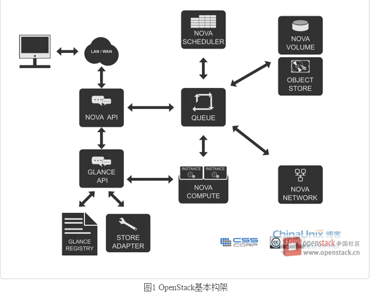
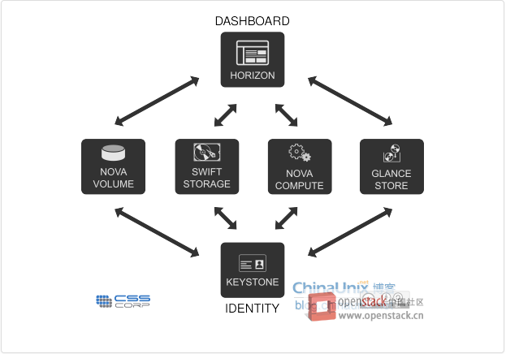
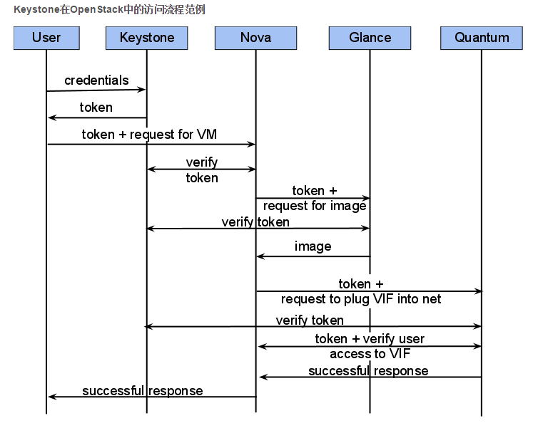

**openstack学习总结**

OpenStack由以下5部分构成的：
1. Nova-计算服务
2. Swift-存储服务
3. Glance-镜像服务
4. Keystone-认证服务
5. Horizon -UI服务

Keystone、Dashboard二者与其它OpenStack部分的交互

Nova——OpenStack计算设施：
Nova是OpenStack计算的弹性控制器。OpenStack云实例生命期所需的各种动作都将由Nova进行处理和支撑，这就意味着Nova一管理平台的身份登场，负责管理整个云的计算资源、网络、授权及测度。虽然Nova本身并不提供任何虚拟能力，但是它将使用libvirt API与虚拟机的宿主机进行交互。Nova通过Web服务API来对外提供处理接口，而且这些接口与Amazon的Web服务接口是兼容的。

功能及特点
1. 实例生命周期管理
2. 计算资源管理
3. 网络与授权管理
4. 基于REST的API
5. 异步连续通信
6. 支持各种宿主：Xen、XenServer/XCP、KVM、UML、VMware vSphere及Hyper-V

Nova弹性云包含以下主要部分：
1. API Server(nova-api)
2. 消息队列（rabbit-mq server）
3. 运算工作站（nova-compute）
4. 网络控制器（nova-network）
5. 卷管理（nova-volume）
6. 调度器（nova-scheduler）

Glance——OpenStack镜像服务器
OpenStack镜像服务器是一套虚拟机镜像发现、注册、检索系统，我们可以将镜像存储到以下任意一种存储中：
1. 本地文件系统
2. OpenStack对象存储
3. S3直接存储
4. S3对象存储（作为S3访问的中间渠道）
5. HTTP（只读）

功能及特点
提供镜像相关服务

Glance构件
1. Glance控制器
2. Glance注册器

Swift——OpenStack存储设施
Swift为OpenStack提供一种分布式、持续虚拟对象存储，它类似于Amazon Web Service的S3简单存储服务。Swift具有跨节点百级对象的存储能力。Swift内建冗余和失效备援管理，也能够处理归档和媒体流，特别是对大数据（千兆字节）和大容量（多对象数据）的测度非常高效。

功能及特点
1. 海量对象存储
2. 大文件（对象）存储
3. 数据冗余管理
4. 归档能——处理大数据集
5. 为虚拟机和云应用提供数据容器
6. 处理流媒体
7. 对象安全存储
8. 备份与归档
9. 良好的可伸缩性

Swift组件
1. Swift帐户
2. Swift容器
3. Swfit对象
4. Swift代理
5. Swift RING

Keystone——OpenStack认证服务
Keystone为所有的OpenStack组件提供认证和访问策略服务，它依赖自身REST（基于Identity API）系统进行工作，主要对（但不限于）Swift、Glance、Nova等进行认证与授权。事实上，授权通过对动作消息来源者请求的合法性进行鉴定。
Keystone采用两种授权方式，一种基于用户名/密码，另一种基于令牌（Token）。除此之外，Keystone提供以下三种服务：
1. 令牌服务：含有授权用户的授权信息
2. 目录服务：含有用户合法操作的可用服务列表
3. 策略服务：利用Keystone具体指定用户或群组某些访问权限

Horizon——OpenStack管理的Web接口
Horizon是一个用以管理、控制OpenStack服务的Web控制面板，他可以管理实例、镜像、创建密钥对，对实例添加卷、操作Swift容器等。除此之外，用户还可以在控制面板中使用终端（console）或VNC直接访问实例。。总之，Horizon具有如下特点：
1. 实例股哪里：创建、终止实例，查看终端日志，VNC连接，添加卷等
2. 访问与安全管理：创建安全群组，管理密钥对，设置浮动IP等
3. 偏好设定：对虚拟硬件模板可以进行不同偏好设定
4. 镜像管理：编辑或删除镜像
5. 查看服务目录
6. 管理用户、配额及项目用途
7. 用户管理：创建用户等
8. 卷管理：创建卷和快照
9. 对象存储处理：创建、删除容器和对象
10. 为项目下载环境变量