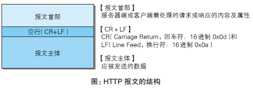
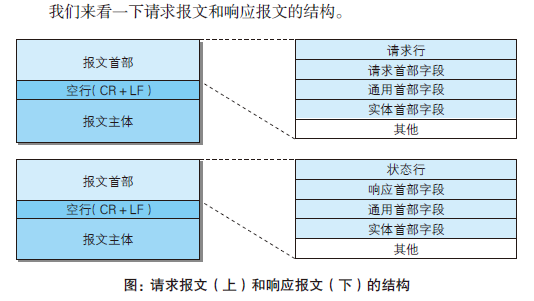
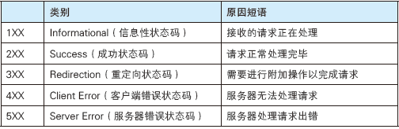
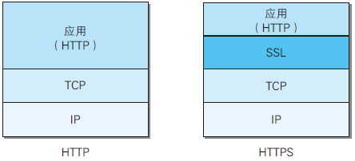
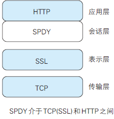
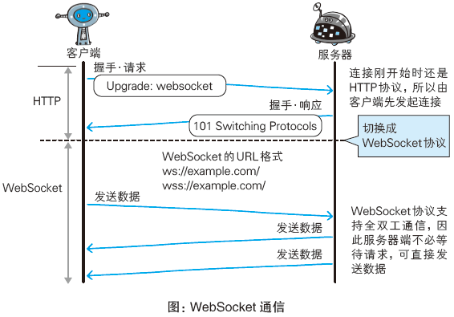
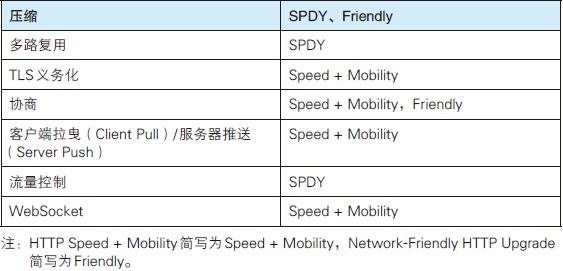

**HTTP协议读书笔记**

通读了一遍"图解HTTP协议"这本书, 确实对HTTP协议有了进一步的认识和理解. 读书笔记如下:

WWW构建技术：
1）把SGML作为页面的文本标记语言HTML
2）作为文档传递协议的HTTP
3）指定文档所在地址的URL

请求报文：
请求报文是由请求方法、请求URI、协议版本、可选的请求首部字段和内容实体构成的。

响应报文：
响应报文基本上由协议版本、状态码（表示请求成功或失败的数字代码）、用以解释状态码的原因短语、可选的响应首部字段以及实体主体构成。

HTTP报文本身是由多行（用CR+LF作换行符）数据构成的字符串文本。HTTP报文大致可分为报文首部和报文主体两块。两者由最初出现的空行（CR+LF）来划分。通常，并不一定要有报文主体。

请求报文和响应报文的首部内容由以下数据组成。
* 请求行：包含用于请求的方法，请求URI和HTTP版本
* 状态行：包含表明响应结果的状态码，原因短语和HTTP版本
* 首部字段：包含表示请求和响应的各种条件和属性的各类首部。一般有4种首部，分别是：通用首部、请求首部、响应首部和实体首部
* 其他：可能包含HTTP的RFC里未定义的首部（Cookie等）

使用首部字段是为了给浏览器和服务器提供报文主体大小、所使用的语言、认证信息等内容。
HTTP首部字段是由首部字段名和字段值构成的，中间用冒号":"分隔。
`首部字段名: 字段值`

另外，字段值对应单个HTTP首部字段可以有多个值。

HTTP首部字段根据实际用途被分为以下4种类型。
1. 通用首部字段（General Header Fields）
请求报文和响应报文两方都会使用的首部。
2. 请求首部字段（Request Header Fields）
从客户端向服务器端发送请求报文时使用的首部。补充了请求的附加内容、客户端信息、响应内容相关优先级等信息。
3. 响应首部字段（Response Header Fields）
从服务器端向客户端返回响应报文时使用的首部。补充了响应的附加内容，也会要求客户端附加额外的内容信息。
4.实体首部字段（Entity Header Fields）
针对请求报文和响应报文的实体部分使用的首部。补充了资源内容更新时间等与实体有关的信息。

HTTP首部字段根据缓存代理和非缓存代理的行为，分成2种类型:
1. 端到端首部（End-to-end Header）
2. 逐跳首部（Hop-by-hop Header）

HTTP方法
1. GET:获取资源
2. POST:传输实体主体
3. PUT:传输文件
4. HEAD:获得报文首部
5. DELETE:删除文件
6. OPTIONS:询问支持的方法
7. TRACE:追踪路径
8. CONNECT:要求用隧道协议连接代理

状态码的职责是当客户端向服务器端发送请求时，描述返回的请求结果。

200 OK 表示从客户端发来的请求在服务器端被正常处理了
204 No Content 表示服务器接收的请求已成功处理，但在返回的响应报文中不含实体的主体部分
206 Partial Content 表示客户端进行了范围请求，而服务器成功执行了这部分的GET请求

301 Moved Permanently 永久性重定向。
302 Found 临时性重定向
303 See Other 请求对应的资源存在着另一个URI，应使用GET方法定向获取请求的资源
304 Not Modified 表示客户端发送附带条件的请求时，服务器端允许请求访问资源，但未满足条件的情况。使用缓存，没有任何的响应主体部分。
307 Temporary Redirect 临时重定向。该状态码与302 Found有着相同的含义。307会遵照浏览器标准，不会从POST变成GET。

400 Bad Request 表示请求报文中存在语法错误。当错误发生时，需修改请求的内容后再次发生请求。
401 Unauthorized 表示发送的请求需要有通过HTTP认证（BASIC认证、DIGEST认证）的认证信息。
403 Forbidden 表明对请求资源的访问被服务器拒绝了
404 Not Found 表明服务器上无法找到请求的资源。（拒绝请求且不想说明理由时使用）

500 Internal Server Error 表明服务器端在执行请求是发生了错误。也可能是Web应用存在的bug或某些临时的故障。
503 Service Unavailable 表明服务器暂时处于超负载或正在进行停机维护，现在无法处理请求。如果事先得知解除以上状况需要的时间，最好写入Retry-After首部字段再返回给客户端。

HTTP通信时，除了客户端和服务器以外，还有一些用于通信数据转发的应用程序，例如：代理、网关和隧道。
1. 代理是一种有转发功能的应用程序，他扮演了位于服务器和客户端“中间人”的角色，接收由客户端发送的请求并转发给服务器，同时也接收服务器返回的响应并转发给客户端。（每次通过代理服务器转发请求或响应时，会追加写入Via首部信息）
2. 网关是转发其他服务器通信数据的服务器，接收从客户端发送来的请求时，它就像自己拥有资源的源服务器一样对请求进行处理。有时客户端可能都不会察觉，自己的同学目标是一个网关。（利用网关可以由HTTP请求转化为其他协议通信）
3.隧道是在相隔甚远的客户端和服务器两者之间进行中转，并保持双方同学来南京的应用程序。（隧道可按要求建立起一条鱼其他服务器的通信线路，届时使用SSL等加密手段进行通信。）

HTTP + 加密 + 认证 + 完整性保护 = HTTPS
通常HTTP直接和TCP通信。当使用SSL时，则演变成先和SSL通信，再由SSL和TCP通信了。即，所谓HTTPS，其实就是身披SSL协议这层外壳的HTTP。

HTTP标准中的瓶颈：
1. 一条连接上只可发送一个请求。
2. 请求只能从客户端开始。客户端不可以接受除响应以外的指令。
3. 请求/响应首部未经压缩就发生。首部信息越多延迟越大。
4. 发送冗长的首部。每次互相发送相同的首部造成的浪费较多。
5. 可任意选择数据压缩格式。非强制压缩发送。

请求异步解决方案:
Ajax解决方案
Ajax（Asynchronous JavaScript and XML，异步JavaScript与XML技术）是一种有效利用JavaScript和DOM（Document Object Model，文档对象模型）的操作，以达到局部Web页面替换加载的异步通信手段。
Ajax的核心技术是名为XMLHttpRequest的API，通过JavaScript脚本语言的调用就能和服务器进行HTTP通信。
而利用Ajax实时地从服务器获取内容，有可能会导致大量请求产生。另外,Ajax仍未解决HTTP协议本身存在的问题。

Comet的解决方法
一旦服务器端有内容更新了，Comet不会让请求等待，而是直接给客户端返回响应。这是一种通过延迟应答，模拟实现服务器端向客户端推送（Server Push）的功能。
通常，服务器端接收到请求，在处理完毕后就会立即返回响应，但为了实现推送功能，Comet会先将响应置于挂起状态，当服务器端有内容更新时，再返回该响应。因此，服务器端一旦有更新，就可以立即反馈给客户端。
内容上虽然可以做到实时更新，但为了保留响应，一次连接的持续时间也变长了。期间，为了维持连接会消耗更多的资源。另外，Comet也仍未解决HTTP协议本身存在的问题。

SPDY协议
SPDY没有完全改写HTTP协议，而是在TCP/IP的应用层与传输层之间通过新加会话层的形式运作。同时，考虑到安全性问题，SPDY规定通信中使用SSL。

使用SPDY后，HTTP协议额外获得以下功能
1. 多路复用流
2. 赋予请求优先级
3. 压缩HTTP首部
4. 推送功能
5. 服务器提示功能

SPDY基本上只是将单个域名（IP地址）的通信多路复用，所以当一个Web网站上使用多个域名下的资源，改善效果就会受到限制。

WebSocket使用浏览器进行全双工通信
当时筹划将WebSocket作为HTML5标准的一部分，而现在他却逐渐变成独立的协议标准。WebSocket即Web浏览器与Web服务器之间全双工通信标准。WebSocket技术主要是为了解决Ajax和Comet里XMLHTTPRequest附带的缺陷所引起的问题。
由于是建立在HTTP基础上的协议，因此连接的发起方仍是客户端，而一旦确立WebSocket通信连接，不论服务器还是客户端，任意一方都可直接向对方发送报文。

WebSocket协议的主要特点：
1.推送功能
2.减少通信量

HTTP/2.0 7项技术
