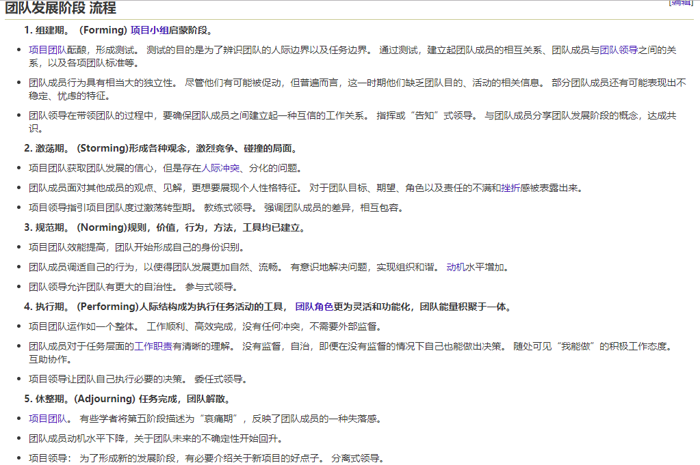

**项目管理学读书笔记**

最近读了基本项目管理学的书, 记录下收获和感受.

***卓有成效的管理者读书笔记***
管理的职能就是计划、组织、整合、激励和考核
管理者的困境：
1. 管理者的时间往往只属于别人，不属于自己。组织的囚徒。
2. 管理者往往被迫忙于”日常运作“，除非他们敢于采取行动来改变周围的一切。无法判断什么是真正重要的事项。
3. 管理者本身处于一个”组织“之中。只有当别人能够利用管理者的贡献时，管理者才算有效。知识工作者彼此之间最难协调，其原因正是由于他们是知识工作者。贡献在于”旁系人士“或是管理者本人的上司。
4. 管理者身处一个组织的”内部“，受到组织的局限。在组织的内部，不会有成果出现，一切成果都存在于组织之外。在组织内部只有人工和成本。
我们既然不能增加资源的供应量，就应该设法增加资源的产出量。所谓有效性，就是使能力和知识资源能够产生更多更好成果的一种手段。
卓有成效的管理者必须在思想上养成的习惯：
1. 有效的管理者知道他们的时间用在什么地方。他们所能控制的时间非常有限，他们会有系统地工作，来善用这有限的时间
2. 有效的管理者重视对外界的贡献。他们并非为工作而工作，而是为成果而工作。”别人期望我做出什么成功“
3. 有效的管理者善于利用长处，包括自己的长处、上司的长处、同事的长处和下属的长处。他们还善于抓住有利形势，做他们想做的事。他们不会把工作建立在自己的短处上，也绝不会去做自己做不了的事
4. 有效的管理者集中精力于少数重要的领域，在这少数重要的领域中，如果能有优秀的绩效就可以产出卓越的成果。他们会按照工作的轻重缓急设定优先次序，而且坚守优先次序。
5.  最后，有效的管理者必须善于做有效的决策。他们知道有效的决策事关处事的条理和秩序问题，也就是如何按正确的次序采取正确的步骤。他们知道一项有效的决策，总是在“不同意见讨论”的基础上做出的判断，它绝不会是“一致意见”的产物。他们知道快速的决策多为错误的决策，真正不可或缺的决策数量并不多，但一定是根本性的决策。他们需要的是正确的战略，而不是令人眼花缭乱的战术。

掌握自己的时间：
1. 记录时间  
2. 管理时间 
3. 统一安排时间

每一位知识工作者，尤其是每一位管理者，要想有效就必须能将时间做整块的运用。如果将时间分割开来零星使用，纵然总时间相同，结果时间也肯定不够。
沟通和交流很重要，如果没有交流，知识工作者就容易丧失热情，成为得过且过的人，或者是只关注自己的专业领域，看不到整个组织的需要和机会。
人数越多，协调相互关系所需的时间越长，而真正用于工作的时间便相对地减少了
减少时间浪费的方式;
1. 首先要找出什么事根本不必做，这些事做了也完全是浪费时间，无助于成果。
2. 哪些事情或者活动可以由别人代为参加而又不影响效果
3. 管理者在浪费别人的时间

人总有一种倾向，高估自己地位的重要性，认为许多事非躬亲不可
时间浪费的原因:
1. 由于缺乏制度或远见而产生时间浪费的因素。应注意的现象，是机构中一而再、再而三出现同样的“危机”
2. 人员过多，也常造成时间浪费.因为大家的时间，可能没有花在工作上，而是用来协调人员之间的关系了。工作时间的1/10花在处理所谓“人际关系问题”上
3. 另一个常见的浪费时间的原因，是组织不健全。其表现就是会议太多. _所谓会议，顾名思义，是靠集会来商议，是组织缺陷的一种补救措施,会时就不能工作，工作时就不能开会，谁也不能同时又开会又工作._  一个结构设计臻于理想的组织，应该没有任何会议
4. 最后一项浪费时间的因素，是信息功能不健全.同样常见的现象，是信息的表达方式不当。其后果有时更为严重
时间管理的最后一步，应该是将可由管理者自行支配的零碎时间集中起来。

专业人员必须使他本人有效，必须使他的专长有效。他必须考虑到他的产出供什么人使用，也必须了解用户应该知道些什么才能有效使用他的产出，从而产生成果。

有效的人际关系，有下列四项基本要求：
1. 互相沟通，沟通是双向的，上下互相沟通
2. 团队合作，强调贡献有助于横向的沟通，因此能够促成团队合作
3. 自我发展，个人能否有所发展，在很大程度上要看你是否重视贡献
4. 培养他人，重视贡献的管理者必然会同时启发他人

有效的管理者在会议开始时，会先说明会议的目的和要求达成的贡献

有效的管理者能使人发挥其长处。他知道只抓住缺点和短处是干不成任何事的，为实现目标，必须用人所长——用其同事之所长、用其上级之所长和用其本身之所长。利用好这些长处可以给你带来真正的机会。充分发挥人的长处，才是组织存在的唯一目的。要知道任何人都必定有很多缺点和短处，而缺点和短处几乎是不可能改变的。但是我们却可以设法使其不发生作用。管理者的任务，就是要充分运用每一个人的长处，共同完成任务。

如何管理上司
要使上司能发挥其所长，不能靠唯命是从，应该从正确的事情着手，并以上司能够接受的方式向其提出建议。

领导人和一般人之间总有一段差距。领导人的绩效高了，一般人也竞相争高。有效的管理者一定明白这层道理：提高领导人的水平容易，但提高全体人员的水平很难。所以，他一定要找出有条件做出突出贡献，并能起带头作用的人才，赋予他们领导人的地位，把他们安置到能“制订标准”并能创造成绩的位置上。

卓有成效的秘诀是善于集中精力。卓越成效的管理者总是把重要的事情放在前面先做（first tings first），而且一次只做好一件事（do one thing at a time）。
管理者越是想做重大的贡献，越是需要有更长的“整块时间”。管理者越是想将繁忙纷杂转化为成就，越是需要持续不断的努力，越是需要较长的连续性的时间。

有效的管理者打算做一项新的业务，一定先删除一项原有的业务。这对控制组织的“膨胀”是非常必要的。“膨胀”如不加以控制，组织就会变得涣散、难以管理。社会组织恰如生物有机体，必须保持小而精的状态。（摆脱昨天）

先后次序的考虑
我们要做的并不只是弄清楚哪些事情必须优先去做，那是很容易做到的，每个人都可以做得到。很多管理者不能做到集中精力于某项工作，其主要困难在于他们确定不了哪些事情可以缓一缓，就是说要能确定哪些事情可以暂时不去做，并且能把这一决定坚持到底。

决策的五个要素
1. 要确实了解问题的性质，如果问题是经常性的，那就只能通过一项建立规则或原则的决策才能解决。
2. 要确实找出解决问题时必须满足的界限，换言之，应找出问题的 “边界条件”。
3. 仔细思考解决问题的正确方案是什么，以及这些方案必须满足哪些条件，然后再考虑必要的妥协、适应及让步事项，以期该决策能被接受。
4. 决策方案要同时兼顾执行措施，让决策变成可以被贯彻的行动。
5. 在执行的过程中重视反馈，以印证决策的正确性及有效性。

***人件***
管理者的作用不是让大家去工作，而是创造环境，让大家可以顺利开展工作。
在单一思考的工作时间里，理想情况下人们处于心理学家称为“流”（Flow）的状态中。流是一种深度的近乎冥想的融入情况。在这种状态下，有一种普适幸福感存在，人们几乎不会意识到时间的流逝：“我开始工作。等我抬头一看，三个小时就过去了“。 这里不会有工作量的感知；工作开展就像流一样自然。
一代人的科技会成为下一代人的环境。

团队自毁技巧清单
+ 防御式管理
+ 官僚主义
+ 物理分隔
+ 时间碎片
+ 牺牲产品质量
+ 伪造截止日期
+ 团伙控制
+ 空洞的口号
+ 变态的加班

团队形成的化学反应
+ 建立对质量的执著追求
+ 提供诸多满意的闭环
+ 建立精英意识
+ 允许和鼓励差异性
+ 维护和保护成功团队
+ 提供战略而不是战术方向

优质管理的四大要素：
1. 选择正确的人
2. 为他们分配正确的工作
3. 保持他们的积极性
4. 帮助团队凝聚起来并保持团队的凝聚力
（其他一切都只是“文案”）

安全和变化:
1. 除非感到安全,否则人们就不能去迎接变化
2. 在所有成功的工程中(以及在绝大多数其他有价值的工作中)，变化都是基本的要素之一
3. 安全感的缺乏会让人们反对变化
4. 逃避风险是致命的，因为这会让你也得不到与风险同在的利益
5. 人们可能会因为来自客观世界的直接的恐吓和觉得没有安全感，但是如果察觉到管理者可能滥用权力来惩罚自己，他们也会觉得没有安全感

负面效应
1. 威胁不是提高业绩最好的方法
2. 如果分配的时间一开始就不够，不管威胁有多么吓人，工作也无法按时完成
3. 更糟糕的是，如果目标没有实现，你就必须兑现你的威胁

什么值得做：
1. 基本条件是否成熟
2. 顶头上司是否值得信任
3. 承担这一切是否具有挑战性
4. 一切的努力是否能得到足够的回报
5. 自己是否胜任

管理者必需的身体部位
1. 管理涉及到心、肠胃、灵活和鼻子
2. 因此：用心来领导，相信你的肠胃（相信你的预感），构筑团队的灵魂，训练一个能嗅得出谎言的鼻子
项目成功的关键是让人们能够更有效地在一起学习。如果他们完全分散工作，如果只是一些彼此不认识的在不同地方工作，那么灵魂就无所谓了。管理也就简单了，只需要协调他们的工作就可以，这就成了一个完全机械化的事情了。现实的世界要求团队成员之间有紧密的、温暖的甚至是亲密的联
系，还要求组织内部有简单而有效的交流

用指挥战争来作为管理的一个比喻
1. 在战役开始的时候, 管理者真正的工作已经完成了

面试和招聘
1. 招聘涉及到所有与管理相关的身体部位：心、灵魂、鼻子和肠胃（但是主要是肠胃）
2. 不要试图单独去招聘：两幅肠胃远比一副肠胃的两倍要好
3. 对于新的雇员，让他们承担与以前曾经成功过的同样难道的项目，把有挑战性的目标推迟到下一次
4. 征求提示：你最希望雇的那个人可能还知道其他很好的人选
5. 多听，少说
6. 如果先把材料整理好，那么所有的事情都会进行得更好

生产力的提高
1. 没有“短期生产力提高” 这样的东西
2. 生产力的提高是来自长期投资的
3. 任何承诺立刻见效的东西都很可能是江湖游医所卖的万灵油

风险控制
1. 通过控制风险来管理项目
2. 为每个项目创建并维护风险统计表
3. 跟踪根源性的风险，而不只是最后那讨厌的结果
4. 评估每种风险具体化的概率和可能造成的开销
5. 对于每种风险，预测标志其具体化的早期征兆
6. 任命一个风险控制官，这个人不应该维护组织内部“我能行”的态度
7. 建立简单的（可能是匿名的）通道，让坏消息能传递到高层

防止失败
1. 壮士断腕
2. 控制住失败比优化成功更能提高你全面的成绩
3. 除非有必要，否则就不要自己去凝聚一个团队：出去找一个已经成型的团队来用
4. 保持好的团队在一起（只要他们自己愿意），以帮助你的继任者避免团队凝聚得慢或者不能凝聚的问题
5. 把凝聚在一起的团队——准备好，并且也愿意接受新的工作——作为项目的收获之一
6. 项目开始浪费的一天和最后阶段浪费的一天对项目造成的伤害是同等的
7. 有无数中方法可以浪费一天的时间，但是没有任何一种方式可以拿回一天的时间

团队的总生产率影响因素
1. 团队可用人员数
2. 还没有融入团队的新成员数
3. 交流损失
4. 融合开销
交流损失是一个静态的值，损失值应该是时间动态函数，团队随着共同工作的时间越来越长，团队能够逐渐消除交流损失。成员们在一起经历很多事情，团队就会变得越来越健壮，甚至能够克服交流的损失。作为一个整体，团队能够比单个个体的简单加和做得更好。

度量
1. 度量每个产品的规模
2. 不要执着于单位 - 在等待客观度量的时候，用你自己的主观单位
3. 从所有能得到的原始数据（可计算的软件特性）自己构造度量单位
4. 从已经完成得项目中收集原始数据，以推导出生产力趋向
5. 借助数据库画一条趋势线，把预期工作量作为人造度量值的函数显示出来
6. 现在，针对每个要评估的项目，计算出人造度量单位值，并根据这个值在趋势线上找到预期工作量
7. 用生产力趋势周围的干扰水平作为映射的标示

改变完成工作的方式
1. 如果不大幅度减少调试的时间，就没办法让项目大幅度提前完成
2. 高速完成的项目用在调试上的时间也成比例地少得多
3. 高速完成的项目用在设计上的时间也成比例地多得多
4. 如果你不关心别人，不照顾别人，就别想让他们为你做一些不同寻常的事情。如果要让他们改变，就必须去了解（并赞赏）他们的过去

压力的效果
1. 压力之下的人无法更快地思考
2. 增加加班时间只会降低生产力
3. 短期的压力乃至于加班可能是有用的策略，因为他们能使员工集中精力，并且让他们感到工作的重要性。但是长期的压力肯定是错误的。
4. 经理之所以会施加那么多的压力，也许是因为他们不知道该做什么，或者因为其他办法的困难而感到气馁。
5. 最坏的猜测：使用压力和加班的真正原因是为了在项目失败的时候，让所有人看上去能好点。
6. 最法西斯的做法：管理就像是替驴子干活一样，相信压力能极大地提高生产力，也许能让项目完成的时间缩短一半，甚至超过一半。
7. 加班会使人在正常工作日中浪费时间。提升工作效率应该是：雇人、激励、团队变动、留住优秀的人、排除掉无用的方法、减少会议、减少加班、减少多余的文档。但是这是一个非常难的操作和道路。

如果一堆程序员感觉不到自己的价值（或做事情的价值），他们是不会形成特别紧密的团队的。

含糊的规格文档
1. 规格文档中的含糊标志着不同的系统参与者之间存在着未解决的冲突
2. 如果一份规格文档不包含完整的输入输出列表，那么它就是毫无希望的：它根本就没开始说明任何东西
3. 没有人会告诉你一份规格文档是不是糟糕。人们往往倾向于责备自己，而不是责备文档。

冲突
1. 团队所有人的目标一致的时候，才有可能没有冲突。但是实际上是，团队很复杂，不同的人有不同的目标，这才是合理的组织，这样冲突就可能产生了。
2. 冲突应当引起重视。冲突并不是缺乏职业道德的行为。
3. 应当提前声明：所有人的“赢”都是受重视的。确保每个级别的人都能赢
4. 谈判困难；调解容易
5. 如果两个人的利益是完全或者部分相斥的，预先做好安排，准备好请双方通过调解来解决冲突
6. 记住：我们都站在同一边，跟我们对立的，是我们要解决的问题。

催化剂的角色
1. 有这样一种催化剂式的人物，这样的人能够帮助团队成型并凝聚，保持团队的健康和生产力，从而对项目做出贡献。就算“催化剂”别的什么事情都不干（其实，通常他们还会干很多别的事），这种催化剂的角色也是重要而有价值的
2. 调解是“催化剂”的一项特殊工作。调解是可以学的，而且只需要很小的投资就能学会
3. 调解应该从一个小小的仪式开始。“我能帮你们调解一下吗？” 在解决冲突的时候，这是必要的第一个步骤。

人员安排：
1. 在早期，人员超编会迫使项目跨过关键的设计阶段（这是为了让所有的人有事可做）
2. 如果在设计完成之前，工作先被分给了很多人，那么人与人之间、工作组之间的接口就会很乱套
3. 这会是团队内部耦合度提高，会议时间、重复劳动和无效工作都会增加
4. 理想的人员安排是这样：在项目的大部分时间里由小型核心团队来做设计工作，在开发的最后阶段（时间安排的最后1/6）加入大量的人手
5. 可怕的猜想：时间安排紧迫的项目，与时间安排比较合理的项目比起来，完成的时间反而会更长

项目社会学：
1. 让不必与会的人可以放心离开，从而保证会议的精简。有一份公开的议程，并严格执行，这是最简单的办法
2. 项目需要仪式
3. 用小小的仪式来使人们注意项目的目标和理想的状态：小规模会议、零缺陷工作等等
4. 采取行动，防止人们随便发怒
5. 记住：愤怒=恐惧。随便对下级发怒的经理一定是因为恐惧才会这样做的
6. 意见： 如果所有人都懂得“愤怒=恐惧”这个道理，就能明显地看出发怒的人是在害怕。由于无法再隐瞒自己的恐惧，他也就不会再生气了。

病态的政治（旧话重提）
1. 别想根治一个病态的人
2. 不要浪费时间，也不要因为尝试治疗上司的病态而使自己受到威胁
3. 有时候，你唯一的选中就是等待，等问题自己解决，或者等一个让你继续前进的机会
4. 奇迹时有可能发生的（但是千万别去指望它）

精兵简政
1. 精兵简政是支败公司使用哦办法，它让员工负担失败的责任
2. 公司的目标应该正好相反：兴旺而人性化
3. 当你听到“精兵简政”这个词的时候，请记住它的玄外之音：失败和恐吓

基本常识：
1. 项目既需要目标，也需要计划
2. 而且这两者应该不同

最后贴一张在MBAlib中看到的 [布鲁斯·塔克曼的团队发展阶段模型](https://wiki.mbalib.com/wiki/布鲁斯·塔克曼的团队发展阶段模型)
