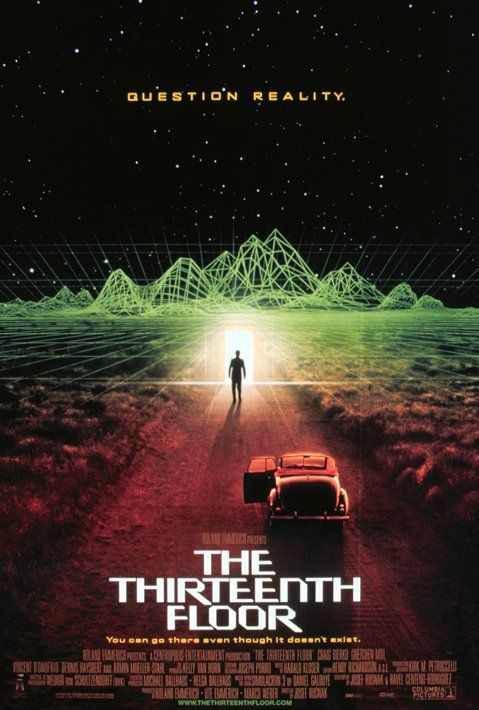

**虚拟与现实，关于世界的本质**

最近看了一部不错的科幻电影——《异次元骇客》，这部电影的整体设想是围绕着计算机世界中的虚拟现实展开的。故事大致是主人公 为了解开一起谋杀案的谜 团， 在虚拟 和现实中来回穿梭，最后发现了更为惊人的事实。虽然本部影片是一部软科幻作品，但其中还是包含了许多值得人思考的东西。什么是虚拟，什么是现实，世界的本质又是什么？

关于计算机模拟现实的科幻电影和小说多不胜数，其中最出名的要数《骇客帝国》。骇客帝国中主角现实的世界和计算机虚拟的世界是两个不同的世界，虚拟世界完全由计算机——超级电脑来进行控制，生活在虚拟中的人大部分都不知道自己是计算机模拟虚构出来的。对于虚拟世界的人来说，他们所生活的即是现实。也就是说，以不同的角度来看，虚拟和现实只不过是一位二体，它们之间的界限是很模糊的。在《 异次元骇客》中，虚拟世界所在的电脑是放在大楼的13层的。通过13这个数字，导演想告诉我们一些信息，就是当一个“人”开始掌握虚拟和现实之间的差异，并意识到自己是“虚拟”的时候，也是他背叛了“神”的时候。

根据这种虚拟即是现实的假设来看待我们的世界或者宇宙的时候，是一件非常有趣的事情。霍金曾经说过，物理学的终极目标是发现世界的本质，即一个万能的方程式来解释一切。物理学的本质是找到世界的规律，但世界的规律是怎么来的，那个万能的方程式是谁设置的？我假设所谓的宇宙只不过是一个运行在超级电脑中的程序，宇宙的万物都是这个程序01排列的一部分。我们之所以会思考，会行动都是程序设定好的，一些看似偶然的也许是必然，一切都是根据这个程序中核心的算法——万能方程式在运行。进一步联想一些其他事情，比如：宇宙真的是无限大的吗？——会不会是程序设置的边界保护机制；奇点的状态是什么？——会不会是程序的初始值；为什么会有时间的概念——会不会是一种内存回收机制等等。如果世界的本质真的是一个类似程序的东西，那么它一定是运行在一个超乎我们能够理解的计算机系统（集群？数据中心？超级互联网？）之上的，会不会是超级”云“。并且这个程序应该有时也产生BUG，毕竟是没有完美的程序，而我们会不会就是BUG的产物。

但思想或者说灵魂真的能被模拟出来嘛？信息论假说认为，世界的第四维到处分布着信息，任何东西都是信息的载体，信息主导论了我们的世界和思想，我们的所产生的一切情感和思维都是信息释放的产物。如果是真的，那么一切就能够用01表示，包括我们自己的肉体和灵魂。计算机是一种信息的表现载体，信息可以说是计算机的灵魂，就好比DNA构造了我们，其实重要的是DNA中包含构造我们的信息。也许有一天，可以将所有人的信息都存储到计算机中去，包括构造我们身体的信息和思想的信息。这样人就会在计算机内重生，生活在计算机内，那里的世界也许和我们这里的世界没什么区别，可能还会好的多——也许人类能够摆脱内存的回收”生老病死“。

 直到今天为止，我们还并不能理解虚拟和现实之间界限是如何区分的，这个世界的"神"是否真实的存在。也许只有等到我们制造出一个虚拟现实的世界的时候，我们才会开始理解这些。我相信像 《异次元骇客》中这样世界一定会被我们创造出来的，也许是下一代量子计算机，也许是下N代云计算

“虚拟和现实，世界的本质”本身就是一个很哲学的问题 ，它其实就蕴涵了”我是谁，我从哪里来，我要到哪里去“。用计算机的话说：就是我是一个被Create的”对象“，来自一个内存单元，最终会被系统回收，释放掉占据的内存，而关于”我“本身的意义，要去问编写”我“这个变量的程序员了，”我”只不过执行了他的命令，是他赋予了“我”初值，给了“我”思想。 

人类一思考上帝就发笑，我既是“我”也不是“我”， 最后附上一篇写的很好的  《异次元骇客》影评。

影评：

> 无论《异次元骇客》，还是《环形废墟》，当其中的角色发现自己只不过是一个幻影时，都表现得十分惶恐、不安、困惑……让我们想象那一刻，如果换了是我们自己，我们又会有什么样的反应呢？
> 在另一部更为有名的“骇客”电影——《 骇客帝国 》中，酷哥 基努李维斯 也生活在虚拟现实之中，这是由一个超级计算机系统所控制的虚幻世界，而真正的“现实”则是战争后的一片废墟。当他经过奇妙的旅程，最终睁开眼睛，那位气度不凡的黑人抵抗领袖带着讥讽的微笑说：“欢迎来到现实的废墟”。生活是一场幻影，现实是一片废墟，这的确是可怕的梦魇。
>  村上春树 的小说《 世界尽头与冷酷仙境 》也为我们提供了类似的梦魇。冷酷仙境是主人公生活的现实世界，而所谓的世界尽头则存在于主人公的潜意识之中。当主人公在现实世界中遭遇种种厄运，满身伤痕，最后意识也即将消失，进入永远黑暗的潜意识世界中时，世界尽头中的他却正在努力从虚幻世界重返现实。如同一缕孤魂徘徊于现实与虚幻之间的他将会作出什么选择，又能作出什么选择呢？
> 真真假假的转换，虚虚实实的混淆，已经成为好莱坞电影的常用情节配备，当我们被那些奇诡的故事壮观的场面所吸引时，很容易忘记这些情节背后所隐藏的对于人类自身存在的追问与思考。 
> 这种思考当然是由来以久的，让我们把时间上溯到十七世纪的一个寒冷冬日，怕冷的法国哲学家 笛卡儿 像往常一样，躲到暖和的壁炉里去思考他的那些哲学问题。切莫小觑这看似寻常的一天，后来一位大主教认为，这一天是 欧洲历史 上最倒霉的一天。那么，笛卡儿老兄在壁炉里思考了些什么呢？笛卡儿想到，我们的现实生活可能只是一场梦境，因为我们在做梦时，并不知道在梦中见到的一切是虚假的，只是醒来后才了解到这不过是梦。那么，我们怎么能确定，我们所感受到的真实的一切，不过是另外一场梦呢？笛卡儿还假设，有一个无比强大的恶魔（比如一个超级计算机系统？），出于邪恶的目的，制造了我们周围的一切一切，包括人类的全部历史，我们的全部记忆……笛卡儿对这种种可能进行了周密的思考，众所周知，他的结论是：我思故我在（I think therefore I am.）——只有思考本身才是确定无疑的，由此我们可以确定自身的存在。
> 笛卡儿式的怀疑并不缺少后继者，比如 休谟 认为，除了知觉以外，一切都是不可知的，人只能停留在感觉经验的此岸，无法到达能产生感觉经验的彼岸。就是说，人无法把握世界的本质，感觉经验就象一道屏障，把意识的对象隔离开来，人们永远无法知道这道屏障后面是什么。 康德 把世界分成两个部分：现象界与本体界。人的认识只能局限于现象界，对于本体界，人们则一无所知。
> 从“骇客”扯到 康德 ，我想我已经离题太远了，如何反驳不可知论是哲学家们的事情，我们可以不去管它，还是让我们回到自己的“现实”中来吧。好在我们的现实既不是一片废墟，也不象村上春树笔下的冷酷仙境那么诡异，虽然恐怖事件阴影笼罩，战争烽烟此起彼伏，大部分人仍然可以安居乐业，享受人生。既然我们不可能离开我们所在的现实（或者虚幻），那么又何必去多想呢，就让我们看着《骇客帝国》式的大片，读着村上春树的畅销小说，为了生计来往奔波，感叹汽车房子看来很遥远，太美的女孩总是高不可攀。
> 所以，别问我是谁，别问我来自何方去向何处，因为这个问题永远不会有答案。也许正如一位哲人所说，面对不可言说之事，我们只有保持沉默。